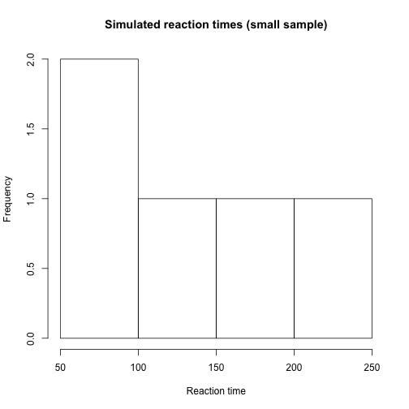

# Introductory remarks

  * Website & material: [https://metodesempirics.github.io/](https://metodesempirics.github.io/)
  * Assignments due before DD, HH:MM


  For each session, you will find:

    * A rendered HTML file 
    * the Rmarkdown source 
    * just the R code (without the text) 
    * data used for the session 


## Goals

  * Lorem ipsum dolor sit amet
  * consectetur adipiscing elit
  * Vestibulum mattis ullamcorper placerat
  * Phasellus quis eros at turpis tempus

## R
We will use the [programming language R](https://www.r-project.org/). You do not need to have programmed neither in R nor any other language before. It is also not necessary to run R code on your machine. This class' code can all be executed online.

That being said, it is highly recommended to install R on your computer. This will give you less dependent on external resources; give you a better sense of how to build your own analysis; and make things run faster. If you do so, I also recommend installing [RStudio](https://rstudio.com/). This is a graphical interface that allows you to manipulate R code and data more easily. As you R itself, you don't strictly need it. Howevre, chances are it's going to make your quantitative life much easier.

  * To install R: follow instructions on [https://www.r-project.org](https://www.r-project.org)
  * To install RStudio: follow instructions on [https://rstudio.com/](https://rstudio.com/)
  * Alternatively: Follow the step-by-step instructions provided by [datacamp](https://www.datacamp.com/community/tutorials/installing-R-windows-mac-ubuntu)

***

# This week's key issues

  * Descriptive statistics review: mean, median, variance, deviation
  * Executing and modifying R code
  * Replicability and reproduceability
  * The research cycle

***

# Descriptive statistics review

## Mean (finite case)
$$\bar{x} = \frac{1}{n} \sum_{i} x_i$$


```r
heights1 <- c(170,178,162,166,183,185) #a vector of heights in cms

mean(heights)
```

```
## Error in mean(heights): object 'heights' not found
```


## Median (finite case)
If the number of elements in $n$ is even:
$$median(X) = x_{\frac{n+1}{2}}$$

If odd:
$$median(X) = \frac{x_{n/2} + x_{(n/2)+1}}{2}$$


```r
sort(heights) #not necessary to compute median, just for illustration
```

```
## Error in sort(heights): object 'heights' not found
```

```r
median(heights)
```

```
## Error in median(heights): object 'heights' not found
```

```r
sort(heights2) #not necessary to compute median, just for illustration
```

```
## Error in sort(heights2): object 'heights2' not found
```

```r
median(heights2)
```

```
## Error in median(heights2): object 'heights2' not found
```

## More examples


```r
heights3 <- c(170,178,162,166,183,185,188,300) #a vector of heights in cms
mean(heights3)
```

```
## [1] 191.5
```

```r
median(heights3)
```

```
## [1] 180.5
```


```r
#Let's automatize and let the computer create some data for us

#We will simulate reaction times (in milliseconds)
#Starting small, generating just 10 observations and telling R that the central tendency is 150 ms, with 20 ms of standard deviation

sim_reaction_times <- rnorm(n = 10, mean = 150, sd = 20) #sample 1000 times from a Normal distribution with mean 150 and sd of 20
print(sim_reaction_times) #look at what reaction times we sampled
```

```
##  [1] 138.5923 142.9182 128.0261 143.2377 146.6273 151.6965 156.1851 140.3068 153.1048
## [10] 143.3027
```

```r
plot(sim_reaction_times) #visualize the reaction times we sampled
```



```r
mean(sim_reaction_times) #calculate their mean
```

```
## [1] 144.3998
```

```r
median(sim_reaction_times) #calculate their median
```

```
## [1] 143.2702
```

```r
#The same thing, but now with more observations sampled

sim_reaction_times <- rnorm(n = 1000, mean = 150, sd = 20) #sample 1000 times from a Normal distribution with mean 150 and sd of 20
print(sim_reaction_times) #look at what reaction times we sampled
```

```
##    [1] 158.64292 136.82015 111.19577 136.12899 137.35702 139.36979 144.78893 166.32260
##    [9] 152.23294 135.47506 151.36974 101.81352 164.08915 142.57950 160.30890 160.26250
##   [17] 127.90239 171.55791 130.59921 151.56580 160.27313 147.17618 144.15826 168.35073
##   [25] 147.35832 141.38306 129.66098 148.54448 166.91708 180.39058 145.62904 144.93404
##   [33] 135.10565 161.53185 131.46436 133.09766 142.40421 157.66946 156.99578 148.12579
##   [41] 123.46717 155.45784 162.06418 156.33322 130.55207 166.34805 129.17722 180.32398
##   [49] 147.79512 112.16092 195.17402 158.59061 153.58017 163.37161 149.94166 138.48541
##   [57] 156.03428 155.02438 124.51625 127.86909 118.58643 153.14247 124.26521 181.50457
##   [65] 155.07686 113.76272 168.78460 169.81961 152.79550 148.82263 129.63567 156.61755
##   [73] 148.90489 142.49304 185.29453 148.43654 159.71845 131.52610 133.30074 134.43107
##   [81] 156.96312 176.17732 182.56173 153.80893 140.50977 156.05870 184.75819 153.98049
##   [89] 162.83659 159.32416 157.23742 166.65130 163.58413 142.61713 123.55818 146.61150
##   [97] 174.38291 148.52455 151.26466 152.68816 162.59627 166.83742 164.50797 129.67755
##  [105] 146.13089 116.37432 115.87152 147.57702 156.39453 143.76366 126.74385 108.88325
##  [113] 142.02067 134.81654 164.12267 142.61162 192.57149 103.46417 156.38142 163.54462
##  [121] 104.92347 124.91256 151.91499 160.35194 158.04970 173.49413 148.41900 142.27899
##  [129] 171.63754 136.11303 150.25506 167.24271 133.41479 172.36718 118.69281 155.62970
##  [137] 144.71018 155.53919 156.82683 143.63711 108.02763 113.40278 123.37109 128.62818
##  [145] 147.01535 107.84311 144.07050 168.88083 129.83986 116.17217 168.60033 164.44383
##  [153] 129.71973 158.34284 143.70437 103.19661 158.89442 133.35634  99.23791 154.11311
##  [161] 125.55024 148.83641 167.10707 111.04347 150.93673 179.66216 144.73325 145.15899
##  [169] 144.95366 149.67109 134.64725 140.49978 133.69288 161.95532 165.78754 143.68162
##  [177] 167.66333 124.92798  94.56849 175.15182 169.56009 124.31574 175.20806 166.58939
##  [185] 169.56205 151.17376 143.75705 166.45122 156.94123 133.94779 199.05471 134.51667
##  [193] 125.05070 151.27302 140.11991 129.18076 150.09767 161.91110 136.84319 165.45293
##  [201] 158.17288 138.73166 147.28464 170.20596 138.98073 105.67668 159.50540 113.85547
##  [209] 149.24315 159.09228 116.59306 165.70877 142.94171 163.83248 188.29521 140.82801
##  [217] 134.44365 146.12655 167.97673 152.61362 144.87100 118.67489 156.25180 139.99079
##  [225] 169.35861 162.86643 134.89073 180.33865 152.38334 143.05432 116.01278 194.29302
##  [233] 172.82233 171.38119 135.47697 131.65197 147.27176 165.53242 147.08950 159.84922
##  [241] 158.80113 153.97286 199.49432 130.59204 179.67565 125.91496 123.54315 152.73693
##  [249] 135.16011 150.04421 119.54989 124.67681 145.16727 125.74119 113.12974 114.93650
##  [257] 150.96347 150.66543 148.18959 144.20543 171.38808 143.37856 135.45082 155.22436
##  [265] 168.85459 138.76794 161.55125 130.86780 141.21771 136.83011 162.18502 166.51997
##  [273] 159.10137 125.04007 136.87966 150.02788 132.66475 185.56835 159.02130 202.48421
##  [281] 166.92953 174.24010 160.48147 125.32816 156.17599 160.69585 170.66004 150.05191
##  [289] 148.09306 165.11638 136.94422 106.54078 134.41869 169.66904 178.85864 148.51715
##  [297] 131.15210 108.57994 159.44689 163.15086 141.72597 170.20646 127.62145 129.77307
##  [305] 167.64831 163.44735 125.24227 137.37487 140.92752 173.71437 126.96523 154.20348
##  [313] 177.35791 167.95096 136.93454 157.15449 106.67534 148.94029 159.86349 147.69315
##  [321] 155.06857 179.66224 145.58218 165.95150 160.87084 134.42632 183.22731 149.37137
##  [329] 175.01713 144.89852 180.19039 143.08573 136.47266 151.90313 157.09247 158.17471
##  [337] 180.34173 168.18226 163.97583 140.98581 136.47430 120.51941 151.50863 125.98191
##  [345] 166.61280 177.99973 173.25679 177.04379 165.35238 148.29781 173.97084 141.12538
##  [353] 125.63664 142.80401 134.71063 171.77545 135.41622 131.65773 141.93570 159.50504
##  [361] 130.41487 124.12656 147.34057 174.21058 133.20413 140.89710 166.94328 141.95916
##  [369] 130.09867 147.02493 152.45258 155.05095 153.92652 132.71967  98.44266 123.62541
##  [377] 151.50490 170.84200 133.74651 159.80817 127.14835 168.77900 149.51061 185.27888
##  [385] 147.88918 175.59502 139.57509 185.40541 152.77690 151.88121 152.94666 158.77389
##  [393] 153.61046 158.83135 163.86156 152.43902 121.35662 140.51392 160.59297 135.86577
##  [401] 173.29906 191.28598 138.11832 134.92806 129.33207 171.01963 170.88406 155.89525
##  [409] 117.69019 122.85825 160.09868 151.87196 156.48057 159.87530 128.27622 178.98543
##  [417] 197.26591 170.64070 158.99052 144.33839 150.23361 128.95193 173.07531 176.02188
##  [425] 123.42679 139.94665 158.13635 128.86672 152.70545 153.51430 154.92371 182.00598
##  [433] 138.68560 165.46964 149.01358 144.08811 164.60306 131.94334 113.84210 143.61684
##  [441] 162.58086 147.70978 144.10709 166.57778 136.82518 164.86408 158.42941 144.91814
##  [449] 140.69993 161.58066  93.99380 128.89018 171.94668 125.46613 177.45214 167.34901
##  [457] 140.08569 163.33225 149.28179 147.13900 153.31459 158.42475 165.69830 140.03264
##  [465] 130.77524 172.15892 142.74812 164.34560 160.87762 123.28315 155.93710 152.99813
##  [473] 171.70396 149.59828 172.73411 148.39902 174.95862 148.60887 142.08662 184.72924
##  [481] 177.32447 173.45880 166.03284 200.62611 164.31233 110.45565 152.56288 153.62510
##  [489] 149.74344 119.89646 144.43439 141.65482 110.06011 155.91924  99.69676 153.30128
##  [497] 151.55920 162.92403 191.30926 175.66051 176.23349 143.73920 186.42324 185.25206
##  [505] 127.35537 125.11070 149.71266 104.74985 164.77662 176.07490 144.74896 186.51297
##  [513] 174.48766 150.66560 158.02389 120.92852 141.26675 141.13295 166.11236 143.38063
##  [521] 179.19918 162.13880 143.36629 149.58216 156.76086 147.04721 171.61561 168.77913
##  [529] 178.44257 166.30045 144.32616 136.68870 123.29798 172.56932 153.07714 170.14673
##  [537]  70.99422 153.40525 151.16636 189.19268 139.17594 150.20743 150.46538 145.63938
##  [545] 111.87253 163.57874 149.81653 152.86843 131.83835 169.09926 130.46723 146.40958
##  [553] 154.95124 174.27818 159.16699 147.54075 178.76228 158.98501 178.39790 169.45954
##  [561] 163.06951 127.47649 145.56058 163.65601 150.89311 100.49459 140.66706 165.58127
##  [569] 112.35302 137.92984 152.75627 169.42657 148.00551 162.22148 169.37943 117.47539
##  [577] 130.16824 159.73553 176.39681 161.92354 125.07132 177.48808 123.47331 190.90394
##  [585] 161.99505 150.60751 175.78874 108.19783 153.91974 152.85565 112.58568 116.22219
##  [593] 130.01863 121.73931 150.41140 121.70747 165.71148 160.16654 160.40569 148.07681
##  [601] 161.87153 146.65247 164.10685 146.74122 141.45775 152.14569 178.70096 152.31695
##  [609] 129.21369 148.57838 183.06818 133.31135 108.09449 145.79993 161.83741 124.42803
##  [617] 121.72286 115.67870 123.26939 139.73747 122.48264 172.71333 131.37655 164.02957
##  [625] 122.33375 149.36081 172.98900 109.91640 155.03065 181.43150 137.27029 167.60336
##  [633] 141.03493 139.50974 151.44420 126.51033 158.77310 140.28345 131.31645 112.91452
##  [641] 127.85447 151.43663 162.86386 127.33570 151.14560 114.94929 136.46252 164.06102
##  [649] 159.69308 141.78745 148.46172 114.71788 142.25417 127.32580 152.91778 194.60241
##  [657] 129.83682 114.29453 157.59747 152.73312 127.08116 155.99444 150.49225 177.58074
##  [665] 165.77768 116.83654 147.40034 178.22785 126.51973 114.74870 135.43919 178.03630
##  [673] 148.25601 155.90796 168.52016 170.28034 124.20158 153.98393 123.95740 201.39167
##  [681] 104.61383 147.90786 163.26723 134.08757 141.58629 168.12567 165.20425 139.73545
##  [689] 152.62772 153.41678 159.58818 128.79874 138.83258 147.22982 145.43294 138.80388
##  [697] 154.08699 157.84422 147.59533 154.40291 167.20804 160.33633 138.35980 154.04355
##  [705] 151.25021 147.93106 119.36362 193.96636 130.42971 143.30562 152.25851 169.27363
##  [713] 182.55192 114.27476 144.22136 130.38851 153.64495 165.87705 151.49810 152.57146
##  [721] 141.23627 141.66512 150.17477 115.52742 152.58841 142.36460 130.35382 145.70742
##  [729] 159.55422 109.09004 137.53685 141.66837 165.78573 141.62910 143.48620 151.44317
##  [737] 122.78220 128.83323 122.50653 143.38286 121.66055 165.28679 171.04837 156.95006
##  [745] 140.94616 185.11273 132.22025 131.77034 151.92829 157.84849 154.96887 122.38447
##  [753] 144.44774 152.48652 126.76958 126.80057 147.47929 197.07868 140.74290 173.96455
##  [761] 155.49710 161.95446 143.75858 147.30310 175.58131 169.51135 166.17592 181.62320
##  [769] 149.42531 129.63430 173.78034 182.69416 122.73197 111.32064 146.05187 135.31945
##  [777] 193.38648 122.46848 143.78070 162.63479 158.13929 114.60215 166.34521 181.78220
##  [785] 141.15872 115.30227 108.85690 155.50553 173.97226 130.20059 136.36393 142.01618
##  [793] 171.40822 134.54685 169.72397 178.97670 146.61255 164.45777 143.48800 137.86231
##  [801] 158.75917 154.44642 137.98991 164.95600 155.96088 137.94744 139.50030 155.49093
##  [809] 144.22925 116.10593 148.88242 123.36985 121.86453 138.83158 134.70692 169.38069
##  [817] 138.20004 175.17404 135.72226 182.62072 168.17106 171.78761 160.71711 181.73238
##  [825] 153.11095 125.13197 124.77721 119.32781 163.80082 184.60706 166.14770 189.95921
##  [833] 143.58879 159.76047 140.87351 147.60974 153.59700 168.17306 143.11299 145.46414
##  [841] 163.94449 135.91520 156.20896 114.05858 171.04441 125.98589 109.29215 184.21663
##  [849] 165.60503 154.29426 129.47124 178.79066 163.17827 197.03462 151.57657 166.79490
##  [857] 146.35303 163.39796 185.35340 102.19800 150.33143 177.24249 157.27124 160.39270
##  [865] 164.46542 140.00347 136.75734 162.56848 135.64044 108.25503 172.30153 156.37416
##  [873] 139.87853 166.79833 157.59935 165.87917 140.38356 166.89096 127.96355 174.00968
##  [881] 114.95992 174.22574 206.72413 141.48615 132.36691 121.21826 118.77620 120.27634
##  [889] 125.36292 140.57341 132.21906 149.03105 164.21691 132.84990 154.87019 175.81192
##  [897] 143.71337 160.31209 149.63795 164.65188 161.96633 145.48602 130.80428 154.26840
##  [905] 156.13109  95.73228 145.19060 134.43717 154.17717 131.66543 157.99437 151.81679
##  [913] 141.61899 141.01917 139.64755 128.23171 168.24728 168.15563 145.19367 142.10879
##  [921] 134.33998 149.00986 135.91027 136.45600 156.99891 131.00547 147.12057 115.34592
##  [929] 151.11757 153.37541 182.23735 148.47121 132.24338 112.16098 165.41700 148.38214
##  [937] 119.22183 137.08653 166.78167 164.17313 137.50166 206.87541 159.20393 158.98170
##  [945] 124.75789 116.98645 147.79556 164.73231 146.91944 158.16414 137.96655 142.87427
##  [953] 127.65407 186.65741 203.75986 155.88626 144.61956 156.00347 149.73084 169.07559
##  [961] 144.29299 168.87582 179.84700 137.51792 126.86457 191.60280 135.85497 158.89520
##  [969] 164.82417 167.85389 124.65730 166.52706 133.29384 149.21751 147.55743 158.28398
##  [977] 166.58706 170.24131 149.30473 167.10577 148.02095 139.84251 142.80758 163.54551
##  [985] 181.26304 129.60244 117.75995 169.73834 149.10911 135.69970 155.87403 150.19087
##  [993] 127.04078 134.57157 122.51228 178.33610 124.30617 145.38905 135.62656 142.75637
```

```r
plot(sim_reaction_times) #visualize the reaction times we sampled
```


```r
mean(sim_reaction_times) #calculate their mean
```

```
## [1] 149.2666
```

```r
median(sim_reaction_times) #calculate their median
```

```
## [1] 149.7217
```

```r
plot(density(sim_reaction_times))
```


```r
#Changing the generating distribution
sim_reaction_times_g <- rgamma(n = 1000, shape=1, scale=150) #sample 1000 times from a Gamma distribution with mean 150 and sd of 20

plot(sim_reaction_times_g)
```


```r
mean(sim_reaction_times_g)
```

```
## [1] 144.06
```

```r
median(sim_reaction_times_g)
```

```
## [1] 97.52701
```

```r
plot(density(sim_reaction_times_g))
```


## Variance & standard deviation


$$\sigma_X = \sqrt{\frac{1}{n-1}\sum_{i}^{n}(x_i - \bar{x})^2}$$


```r
heights
```

```
## Error in eval(expr, envir, enclos): object 'heights' not found
```

```r
var(heights)
```

```
## Error in is.data.frame(x): object 'heights' not found
```

```r
sd(heights) #the same as sqrt(var(heights))
```

```
## Error in is.data.frame(x): object 'heights' not found
```

```r
#Unpacking variance and standard deviation
x_bar <- mean(heights) #this is the mean of the heights
```

```
## Error in mean(heights): object 'heights' not found
```

```r
print(x_bar)
```

```
## Error in print(x_bar): object 'x_bar' not found
```

```r
dev_heights <- heights - x_bar #deviations of each height from the mean
```

```
## Error in eval(expr, envir, enclos): object 'heights' not found
```

```r
print(dev_heights)
```

```
## Error in print(dev_heights): object 'dev_heights' not found
```

```r
squared_dev_heights <- devs_heights**2 #squared deviations from the mean
```

```
## Error in eval(expr, envir, enclos): object 'devs_heights' not found
```

```r
print(squared_dev_heights)
```

```
## Error in print(squared_dev_heights): object 'squared_dev_heights' not found
```

```r
sum_squared_dev_heights <- sum(squared_dev_heights) #sum of the squared deviations
```

```
## Error in eval(expr, envir, enclos): object 'squared_dev_heights' not found
```

```r
print(sum_squared_dev_heights)
```

```
## Error in print(sum_squared_dev_heights): object 'sum_squared_dev_heights' not found
```

```r
var_heights <- ( 1 / (length(heights)-1) ) * sum_squared_dev_heights #divide by number of observations - 1
```

```
## Error in eval(expr, envir, enclos): object 'heights' not found
```

```r
print(var_heights)
```

```
## Error in print(var_heights): object 'var_heights' not found
```

```r
print(sqrt(var_heights)) #square root of the variance = std
```

```
## Error in print(sqrt(var_heights)): object 'var_heights' not found
```


***

```r
sessionInfo()
```

```
## R version 3.6.3 (2020-02-29)
## Platform: x86_64-pc-linux-gnu (64-bit)
## Running under: Ubuntu 18.04.5 LTS
## 
## Matrix products: default
## BLAS:   /usr/lib/x86_64-linux-gnu/blas/libblas.so.3.7.1
## LAPACK: /usr/lib/x86_64-linux-gnu/lapack/liblapack.so.3.7.1
## 
## locale:
##  [1] LC_CTYPE=en_US.UTF-8       LC_NUMERIC=C               LC_TIME=es_ES.UTF-8       
##  [4] LC_COLLATE=en_US.UTF-8     LC_MONETARY=es_ES.UTF-8    LC_MESSAGES=en_US.UTF-8   
##  [7] LC_PAPER=es_ES.UTF-8       LC_NAME=C                  LC_ADDRESS=C              
## [10] LC_TELEPHONE=C             LC_MEASUREMENT=es_ES.UTF-8 LC_IDENTIFICATION=C       
## 
## attached base packages:
## [1] stats     graphics  grDevices utils     datasets  methods   base     
## 
## other attached packages:
## [1] knitr_1.32
## 
## loaded via a namespace (and not attached):
## [1] compiler_3.6.3 magrittr_2.0.1 tools_3.6.3    stringi_1.7.3  highr_0.9     
## [6] stringr_1.4.0  xfun_0.22      evaluate_0.14
```
