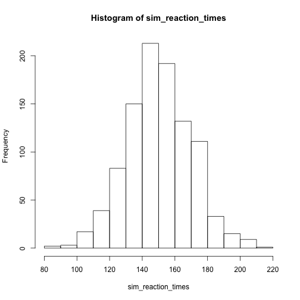
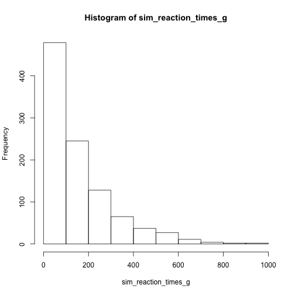

# Introductory remarks

  * Website & material: [https://metodesempirics.github.io/](https://metodesempirics.github.io/)
  * Assignments due before DD, HH:MM

For each session, you will find:
  * A rendered HTML file 
  * the Rmarkdown source 
  * R code (without the text) 
  * A dynamic file 


## Course goals

  * Lorem ipsum dolor sit amet
  * consectetur adipiscing elit
  * Vestibulum mattis ullamcorper placerat
  * Phasellus quis eros at turpis tempus

## R
We will use the [programming language R](https://www.r-project.org/). You do not need to have programmed neither in R nor any other language before. It is also not necessary to run R code on your machine. This class' code can all be executed online. To use R without having to install it go to [https://colab.to/r](https://colab.to/r).

That being said, it is highly recommended to install R on your computer. This will give you less dependent on external resources; give you a better sense of how to build your own analysis; and make things run faster. If you do so, I also recommend installing [RStudio](https://rstudio.com/). This is a graphical interface that allows you to manipulate R code and data more easily. As you R itself, you don't strictly need it. Howevre, chances are it's going to make your quantitative life much easier.

  * To install R: follow instructions on [https://www.r-project.org](https://www.r-project.org)
  * To install RStudio: follow instructions on [https://rstudio.com/](https://rstudio.com/)
  * Alternatively: Follow the step-by-step instructions provided by [datacamp](https://www.datacamp.com/community/tutorials/installing-R-windows-mac-ubuntu)

***

# This week's key issues

  * Descriptive statistics review: mean, median, variance, deviation
  * Executing and modifying R code
  * Replicability and reproduceability
  * The research cycle

***

# Descriptive statistics review

## Mean (finite case)
$$\Large \bar{x} = \frac{1}{n} \sum_{i} x_i$$


```r
heights1 <- c(170,178,162,166,183,185) #a vector of heights in cms

(170 + 178 + 162 + 166 + 183 + 185) * (1 / 6) #calculating the mean explicitly
```

```
## [1] 174
```

```r
sum(heights1) * (1 / length(heights1)) #using sum() and length() functions
```

```
## [1] 174
```

```r
mean(heights1) #using the mean() function directly
```

```
## [1] 174
```


## Median (finite case)
If the number of observations is even and ordered:
$$\Large median(X) = x_{\frac{n+1}{2}}$$

If odd and ordered:
$$\Large median(X) = \frac{x_{n/2} + x_{(n/2)+1}}{2}$$


```r
sort(heights1) #not necessary to compute median, just for illustration
```

```
## [1] 162 166 170 178 183 185
```

```r
median(heights1)
```

```
## [1] 174
```

```r
heights2 <- c(170,178,162,166,183,185,155) #a vector of heights in cms
sort(heights2) #not necessary to compute median, just for illustration
```

```
## [1] 155 162 166 170 178 183 185
```

```r
median(heights2)
```

```
## [1] 170
```

## More examples


```r
heights3 <- c(170,178,162,166,183,185,188,300) #a vector of heights in cms
mean(heights3)
```

```
## [1] 191.5
```

```r
median(heights3)
```

```
## [1] 180.5
```
# Samples, populations, and estimates


```r
set.seed(333)
#Let's let the computer generate the data
#We will simulate reaction times (in milliseconds)

#Starting small, sampling just 5 observations and telling R that the population's mean is 150 ms, with 40 ms of standard deviation

sim_reaction_times <- rnorm(n = 5, #number of samples
                            mean = 150, #mean of the normal distribution
                            sd = 40) #std. deviation of the normal distribution

sim_reaction_times #look at what reaction times we sampled
```

```
## [1] 146.68753 227.38724  67.94841 161.10956  88.96158
```

```r
hist(sim_reaction_times, #data we are plotting
     main = 'Simulated reaction times (small sample)', #title of our histogram
     xlab = 'Reaction time')  #Label of x-axis
```


```r
mean(sim_reaction_times) #calculate their mean
```

```
## [1] 138.4189
```

```r
median(sim_reaction_times) #calculate their median
```

```
## [1] 146.6875
```

```r
#The same thing, but now with 1000 observations sampled

sim_reaction_times <- rnorm(n = 1000, mean = 150, sd = 20) #sample 1000 times from a Normal distribution with mean 150 and sd of 20
hist(sim_reaction_times) #visualize the reaction times we sampled
```



```r
mean(sim_reaction_times) #calculate their mean
```

```
## [1] 150.4272
```

```r
median(sim_reaction_times) #calculate their median
```

```
## [1] 149.6826
```

```r
plot(density(sim_reaction_times))
```


```r
#Changing the generating distribution
sim_reaction_times_g <- rgamma(n = 1000, shape=1, scale=150) #sample 1000 times from a Gamma distribution with mean 150 and sd of 20

hist(sim_reaction_times_g)
```



```r
mean(sim_reaction_times_g)
```

```
## [1] 155.7832
```

```r
median(sim_reaction_times_g)
```

```
## [1] 106.3779
```

```r
plot(density(sim_reaction_times_g))
```


## Variance & standard deviation


$$\Large \sigma_X = \sqrt{\frac{1}{n-1}\sum_{i}^{n}(x_i - \bar{x})^2}$$


```r
heights1
```

```
## [1] 170 178 162 166 183 185
```

```r
var(heights1)
```

```
## [1] 88.4
```

```r
sd(heights1) #the same as sqrt(var(heights))
```

```
## [1] 9.402127
```

```r
#Unpacking variance and standard deviation
x_bar <- mean(heights1) #we assign this number to a variable named x_bar
x_bar
```

```
## [1] 174
```

```r
dev_heights <- heights1 - x_bar #deviations of each height from the mean
dev_heights
```

```
## [1]  -4   4 -12  -8   9  11
```

```r
squared_dev_heights <- dev_heights**2 #squared deviations from the mean
squared_dev_heights
```

```
## [1]  16  16 144  64  81 121
```

```r
sum_squared_dev_heights <- sum(squared_dev_heights) #sum of the squared deviations
sum_squared_dev_heights
```

```
## [1] 442
```

```r
var_heights <- ( 1 / (length(heights1)-1) ) * sum_squared_dev_heights #divide by number of observations - 1
var_heights
```

```
## [1] 88.4
```

```r
sqrt(var_heights) #square root of the variance = std
```

```
## [1] 9.402127
```


***
# Replicability & reproduceability
Lorem ipsum dolor sit amet, consectetur adipiscing elit. Proin feugiat tincidunt luctus. Suspendisse potenti. Nam mauris justo, aliquam sit amet tellus a, sodales placerat odio. Integer vel urna ac risus euismod eleifend. Curabitur vitae justo venenatis ex tincidunt auctor in a massa. Nulla consequat nibh eu lectus tempor gravida. Suspendisse potenti. Nulla ultricies ex in lacus commodo fringilla. In fermentum enim a metus sagittis malesuada.

Proin risus enim, hendrerit eget finibus non, sodales at eros. Sed imperdiet sed ipsum ut efficitur. Cras non felis mi. Nullam massa diam, euismod eu neque at, lacinia consectetur purus. Cras varius tempor purus ut pretium. Curabitur consequat quam eget sapien tristique scelerisque. Orci varius natoque penatibus et magnis dis parturient montes, nascetur ridiculus mus. Maecenas nulla diam, molestie ut odio eget, maximus efficitur nisi. Donec a turpis erat. Suspendisse et arcu laoreet justo auctor venenatis.

***
# The research cycle
Lorem ipsum dolor sit amet, consectetur adipiscing elit. Proin feugiat tincidunt luctus. Suspendisse potenti. Nam mauris justo, aliquam sit amet tellus a, sodales placerat odio. Integer vel urna ac risus euismod eleifend. Curabitur vitae justo venenatis ex tincidunt auctor in a massa. Nulla consequat nibh eu lectus tempor gravida. Suspendisse potenti. Nulla ultricies ex in lacus commodo fringilla. In fermentum enim a metus sagittis malesuada.

Proin risus enim, hendrerit eget finibus non, sodales at eros. Sed imperdiet sed ipsum ut efficitur. Cras non felis mi. Nullam massa diam, euismod eu neque at, lacinia consectetur purus. Cras varius tempor purus ut pretium. Curabitur consequat quam eget sapien tristique scelerisque. Orci varius natoque penatibus et magnis dis parturient montes, nascetur ridiculus mus. Maecenas nulla diam, molestie ut odio eget, maximus efficitur nisi. Donec a turpis erat. Suspendisse et arcu laoreet justo auctor venenatis.

***

```r
sessionInfo()
```

```
## R version 3.6.3 (2020-02-29)
## Platform: x86_64-apple-darwin15.6.0 (64-bit)
## Running under: macOS High Sierra 10.13.6
## 
## Matrix products: default
## BLAS:   /Library/Frameworks/R.framework/Versions/3.6/Resources/lib/libRblas.0.dylib
## LAPACK: /Library/Frameworks/R.framework/Versions/3.6/Resources/lib/libRlapack.dylib
## 
## locale:
## [1] en_US.UTF-8/en_US.UTF-8/en_US.UTF-8/C/en_US.UTF-8/en_US.UTF-8
## 
## attached base packages:
## [1] stats     graphics  grDevices utils     datasets  methods   base     
## 
## other attached packages:
## [1] markdown_1.1 knitr_1.33  
## 
## loaded via a namespace (and not attached):
## [1] compiler_3.6.3 magrittr_2.0.1 tools_3.6.3    stringi_1.6.2  highr_0.9     
## [6] stringr_1.4.0  xfun_0.22      evaluate_0.14
```
