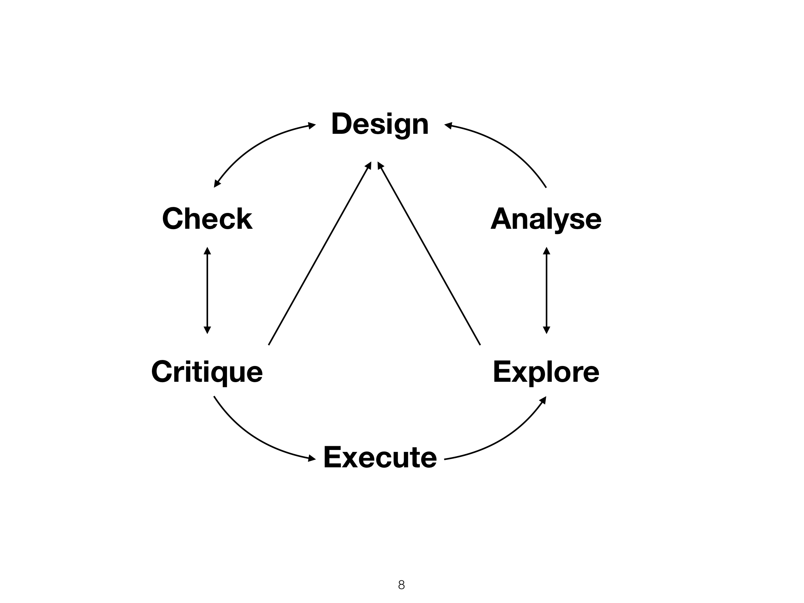

```{r preamble, echo=FALSE, message=FALSE, warning=FALSE}
library(dplyr)
library(ggplot2)
```

# Hoy

.large[
* Organización del curso 

* Diseño de análisis y estadística inferencial 

* Replicabilidad y reproduceabilidad  

* Estadística descriptiva, R
]

---

class: inverse, center

# Organización

---

# Información básica

.large[
* 5 ECTS (~125-150 horas)

* Material y comunicación: https://aulaglobal.upf.edu/

* Equipo
  * Thomas Brochhagen (thomas.brochhagen@upf.edu)
  
  * Guillermo Montaña (guillermo.montana@upf.edu)

* Estructura
  * Martes: Conceptos
  
  * Jueves: Práctica

]

---

# Observaciones sobre lengua
.large[
* Instrucción

* Ejercicios

* Comunicación personal
]


---


# Evaluación
.large[
* Ejercicios semanales (20%, no recuperable)

* Ejercicio práctico (20%, recuperable)

* Revisión por pares (20%, no recuperable)

* Reporte de diseño de análisis y su ejecución (40%, recuperable)
]

---

# Evaluación

.large[
* Ejercicios semanales (20%, no recuperable)
  * A travéz de Aula Global
  
  * Correción automática
  
  * Máximo 2 intentos
  
  * 5/6 en total
]

---

# Evaluación 
.large[
* Revisión por pares (20%, no recuperable)

  * Solamente opción de aprobar, o no

  * No se aprueba si no se entregan los dos documentos; o si cualquiera de ellos no se adecúa a un estándar mínimo
]

---

# Evaluación
.large[
* Ejercicio práctico (20%, recuperable)

  * A travéz de Aula Global
  
  * A mitad de curso

  * Correción automática

  * Un solo intento
]

---

# Evaluación

.large[
* Diseño y ejecución de análisis (40%)
  * Individual o en grupos (división de trabajo debe ser preaprobada)
  * Evaluación en función a tema / tamaño del grupo
  * Máximo dos páginas

* Criterios (max. 100 puntos)
  * Claridad (30): descripción clara y al punto; uso adequado de visualización
  * Replicabilidad (15)
  * Reproduceabilidad (15)
  * Contenido (40): el análisis está bien motivado y ejecutado con métodos adecuados
  * Creatividad (20): supera expectativas en una o múltiples dimensiones, como visualización, temática, metodología, documentación  
]

---

class: inverse, center

# Contenido y motivación

---

# Ciclo de análisis



---

# Sesiones

.pull-left[
* Diseño (1-3)

* Control (3)

* Crítica (3-9)

* Ejecución (3)

* Exploración (3-9)

* Análisis (4-9)
]

.pull-right[
1. Introducción 

2. Diseño de análisis 

3. Recolección de datos y muestras

4. Introducción a la regresión

5. Regresión multivariada
6. Regresión generalizada I

7. Regresión generalizada II

8. Corpus I

9. Corpus II
10. Revisión y predicción
]

---

# Algunas motivaciones
.large[
* Manipulación e interpetación de datos

  * Crítica

  * Limpieza

  * Modelaje
  
  * Visualización

  * (Programación)

* Indispensable para ciencias del lenguaje

* Cada vez más indispensable en el siglo 21

]
---

# A efectos prácticos
.large[
* Manipulación e interpetación de datos

* Comparación de grupos

* Predicción

* Visualización

* (Programación)

... aplicado a ciencias del lenguaje
]
---

class: center, inverse

# Análisis inferencial


---


# Análisis inferencial (vs. descriptiva)
.large[
* Inferencia de propiedades (más allá de la muestra) 

* Predicción

* Comparación

* Causa-efecto 
]
---


.footnote[
*** 
Fig. 1 de Franconeri et al. 2021 [The Science of Visual Data Communication: What Works](https://journals.sagepub.com/stoken/default+domain/10.1177%2F15291006211051956-FREE/full#_i28)]
---

class: center

# Análisis inferencial: Centrado en modelos
<br><br><br><br><br>
.Large[
"All models are wrong, but some are useful"
<br>
George E.P. Box
]
---

class: center

# Análisis inferencial: Centrado en datos
<br><br><br><br><br>
.Large[
"We should only let data speak for themselves when they<br> have learned to clean themselves"
<br><br>
-Erik van Zwet 
]
---

# Regresión

* Estimación del efecto de uno o más *predictores* en un *resultado*

  * Fluidéz en una segunda lengua a base de la primera
  
  * Probabilidad del uso de un pronómbre a base de su entorno lingüístico
  
  * Tamaño de una palabra en función a su frequencia
  
<br><br>  

* Estimación de diferencias entre grupos

  * Comparación de un método de aprendizaje de la lengua contra otro
  
  * Comparación de políticas lingüísticas

---
```{r, echo=FALSE, warning=FALSE, message=FALSE}
library(ggplot2)

set.seed(123)

x <- rnorm(n = 34, mean = 20, sd = 2)
err <- rnorm(n = 34, mean = 0,sd=1)
y <- x/2 + err

df <- data.frame(resultado = y, predictor = x)
ggplot(df, aes(x = predictor, y = resultado)) +
  geom_point() +
  geom_smooth(method='lm') +
  theme_minimal(base_size=20)
```

---

class: inverse, center

# Reproduceabilidad y replicabilidad

--- 

class: inverse, center

# R 

---

class: inverse, center


# Estadística descriptivia