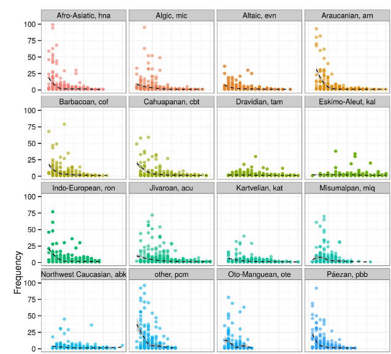
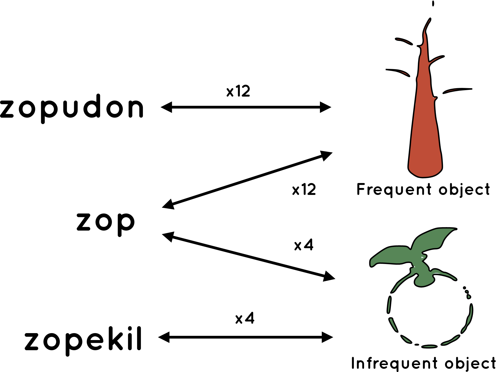

```{r preamble, echo=FALSE, message=FALSE, warning=FALSE}
library(dplyr)
library(ggplot2)
```

# Hoy

.large[
* Componentes de un análisis 

* Datos

* Vocabulario de diseño experimental  

* Formatos y manipulación de datos

]

---

class: inverse, center

# Componentes de un análisis

---

# Componentes

* Pregunta(s) del análisis

* Plan de diseño

* Plan de muestreo (sampling plan)

* Especificación de variables

* Plan de analisis


---

# Componentes

* Pregunta(s) del análisis
  * Pueden variar en grado de granularidad
  
  * Pueden variar en naturaleza: Análisis confirmatorio vs. exploratorio 


* Plan de diseño

* Plan de muestreo (sampling plan)

* Especificación de variables

* Plan de analisis

---

# Componentes

* Pregunta(s) del análisis

* Plan de diseño
  * Descripción general del análisis.
  
  * Entre otros, especifica qué mediras, y bajo que circumstancias

* Plan de muestreo (sampling plan)

* Especificación de variables

* Plan de analisis

---

# Componentes

* Pregunta(s) del análisis

* Plan de diseño

* Plan de muestreo (sampling plan)
  * Cuántas observaciones recolectarás? Cómo? Por qué?

* Especificación de variables

* Plan de analisis

---


# Componentes

* Pregunta(s) del análisis

* Plan de diseño

* Plan de muestreo (sampling plan)

* Especificación de variables
  * Descripción todas las variables que juegan un rol en tu análisis

* Plan de analisis

---

# Componentes

* Pregunta(s) del análisis

* Plan de diseño

* Plan de muestreo (sampling plan)

* Especificación de variables

* Plan de analisis
  * Descripción de cómo analizarás los datos

---


### Zipf's Law of Abbreviation: More frequent forms tend to be shorter
<br><br>
.center[### 
]


 
.footnote[
***

G.K. Zipf (1935) *The psycho-biology of language*<br>
Kanwal et al *Zipf’s Law of abbreviation as a language universal*

]

---

### Zipf's Law of Abbreviation: More frequent forms tend to be shorter
<br><br>
.center[### 
]


 
.footnote[
***

G.K. Zipf (1935) *The psycho-biology of language*<br>
Benz & Ferrer-i-Cancho (2016) * Zipf’s Law of abbreviation as a language universal*


]
---


### Zipf's Law of Abbreviation: More frequent forms tend to be shorter
<br><br>
.center[### 
]


 
.footnote[
***

G.K. Zipf (1935) *The psycho-biology of language*<br>
Benz & Ferrer-i-Cancho (2016) * Zipf’s Law of abbreviation as a language universal*

]

---

# Kanwal et al. 2017

--




---

# Kanwal et al. 2017: Condiciones

1. Comunicación con otro jugador, con diferencial de tiempo entre mensajes
--

2. Comunicación con otro jugador, sin diferencial de tiempo

--

3. Sin otro jugador, con diferencial de tiempo entre mensajes

--

4. Sin otro jugador, sin diferencial de tiempo

---

# Componentes (Kanwal et al. 2017)

* Pregunta(s) del análisis

* Plan de diseño

* Plan de muestreo (sampling plan)

* Especificación de variables

* Plan de analisis

---

# Componentes (Kanwal et al. 2017)

* Pregunta(s) del análisis
  1. Emerge la ley de abreviación de una interacción entre dos presiones linguísticas: brevedad y comunicación?
  
  2. Emerge (1) en un dialogo artificial de laboratorio en un par de rondas?
  
  3. Qué aprendemos de (1), si (2) es correcta?

* Plan de diseño

* Plan de muestreo (sampling plan)

* Especificación de variables

* Plan de analisis

---

# Componentes (Kanwal et al. 2017)

* Pregunta(s) del análisis

* Plan de diseño

  * Analizaremos si un uso de expresiones referenciales que refleja la ley de abreviación de Zipf (más frecuente $\rightarrow$ más corta) emerge en función a una interacción y presencia de dos presiones linguísticas: presión por comunicación y por brevedad. 
  
  * Controlaremos la presencia/ausencia de las presiones en un experimento de laboratorio, usando una lengua artificial para también controlar el inventorio lexico a disposición de cada hablante
  
  * Habrán 4 condiciones: $[\pm comunicación] \; \times \; [\pm brevedad]$
  
  * Esperamos que uso de expresiones referenciales en línea con la ley de abreviación de Zipf sólo emerja si ambas presiones están presentes: $[+ comunicación] \; \times \; [+ brevedad]$

* Plan de muestreo (sampling plan)

* Especificación de variables

* Plan de analisis

---


# Componentes (Kanwal et al. 2017)

* Pregunta(s) del análisis

* Plan de diseño

* Plan de muestreo (sampling plan)

  * 

* Especificación de variables

* Plan de analisis

---


class: inverse

# Próxima sesión

* Entrega de "Assignment 2" (08:00 AM 26/04)

***

* **Recolección de datos y muestras**


