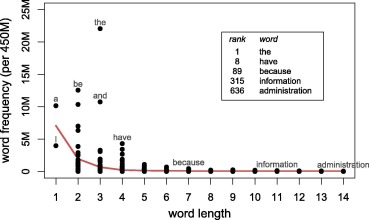

```{r preamble, echo=FALSE, message=FALSE, warning=FALSE}
library(dplyr)
library(ggplot2)
```

# Hoy

.large[
* Las leyes de Zipf

* Corpora y pre-procesamiento

* Aplicaciones

* Word embeddings y más allá

]


class: inverse, center

# Las leyes de Zipf


.footnote[
***

G.K. Zipf (1935) *The psycho-biology of language*⠀⠀⠀⠀⠀⠀⠀⠀⠀⠀⠀

G.K. Zipf (1949) *Human behavior and the principle of least effort*

]

---

### 1. Zipf's (Rank-Frequency) Law

### 2. Zipf's Law of Abbreviation

### 3. Zipf's Meaning-Frequency Law

---

### Rank-Frequency Law: La distribución rango-frecuencia de palabras es inversa

```{r, echo=FALSE}
library(knitr)
include_graphics('Zipf_30wiki_en_labels.png')
```

---

### Law of Abbreviation: Formas frequentes tienden a ser más cortas 


```{r, echo=FALSE, out.width="90%", fig.align='center'}

```

---

### Meaning-frequency Law: Formas frequentes tienden a tener más significados

```{r, echo=FALSE, fig.align='center'}
library(ggplot2)
freqs <- seq(1:100)
meanings <- freqs**0.5
df <- data.frame(freq = freqs,
                 nmeanings = meanings)

ggplot(df, aes(x = freq, y = nmeanings)) + geom_point() +     xlab('Frequency of a word') + ylab('Meanings of the word') + theme_minimal(base_size=22) +
 theme(axis.text.y = element_blank(), axis.text.x = element_blank()) 

```

---

class: inverse, center

# Corpora y pre-procesamiento

---

# Corpora

* Por definición: Cualquier colección de datos

* Por uso: Colección de datos no estructurados, muchas veces de [gran]() tamaño


.footnote[
***

Lo que significa [gran]() varía en función a la naturaleza de los datos, y de cuándo son.]

---

# Associated Press Corpus 

Collection of 2246 news articles, mostly published around 1988

--

```{r, echo=FALSE}
library(tm)
library(knitr)
data("AssociatedPress", package = "topicmodels")
include_graphics('ap-story.png')
```


---

# Tokenización

--

Segmentar y transformar tu corpus para que represente las unidades de tu análisis.

Por ejemplo, palabras, morfémas, o caracteres.

---

# Tokenización a nivel de palabras

```{r, tidy = TRUE}
library(stringr)

first_par <- 'MEXICO CITY (AP) — The Mexican government said Tuesday that COVID-19 has passed from a pandemic to an endemic stage in Mexico, meaning authorities will treat it as a seasonally recurring disease.'

tokenized_first_par <- str_split(first_par, pattern = " ")[[1]]
tokenized_first_par
```

---

# Procesos de normalización de token(e)s

--

## Casing

Convertir todo el texto a minúscula (o mayúscula)

--

## Stemming

Quitar material morfológico, quedandose sólamente con las raíces


## Lematización

Cambiar palabras por sus respectivos lemas.

---

# Casing

```{r}
tolower(tokenized_first_par)
```

---

# Stemming & lemmatization

* cat, cats, cat's, cats'; ...

* to be; am; are; were; ...


---

# AP tokenizada

```{r, echo=FALSE}
library(tidytext)
AP_corpus <- tidy(AssociatedPress)
```

```{r, echo=FALSE}
head(AP_corpus)
```

---

# AP y Zipf?

```{r, echo=FALSE}
AP_ranked <- AP_corpus %>% select(term, count) %>% group_by(term) %>% mutate(count = sum(count)) %>% unique() %>% arrange(desc(count)) %>% ungroup() %>% mutate(length = nchar(term))
AP_ranked$rank <- seq(1:nrow(AP_ranked))
AP_ranked <- AP_ranked %>% mutate(log.count = log(count),
                                  log.rank = log(rank))
AP_ranked %>% head()
```

---

# AP y Zipf I

```{r, echo=FALSE, fig.align='center'}
ggplot(AP_ranked, aes(x = log.rank, y = log.count)) + geom_point(col='indianred') + theme_minimal(base_size = 22)
```

---

# AP y Zipf II

```{r, echo=FALSE, fig.align='center'}
ggplot(AP_ranked, aes(x = length, y = count)) + geom_point(col='indianred') + theme_minimal(base_size = 22)
```

---

# Jane Austen

```{r, echo=FALSE}
library(janeaustenr)

original_books <- austen_books() %>%
  group_by(book) %>%
  mutate(line = row_number(),
         chapter = cumsum(str_detect(text, regex("^chapter [\\divxlc]",
                                                 ignore_case = TRUE)))) %>%
  ungroup()

original_books

```

---

# Jane Austen tokenizada y normalizada

```{r, echo=FALSE}
tidy_books <- original_books %>%
  unnest_tokens(word, text)
tidy_books
```


---

# Jane Austen y Zipf?

```{r, echo=FALSE}
JA_ranked <- tidy_books %>% select(word) %>% count(word) %>% arrange(desc(n)) %>% rename(count = n) %>% mutate(length = nchar(word),
                                                                                                               log.count = log(count))
JA_ranked$rank <- seq(1:nrow(JA_ranked))
JA_ranked <- JA_ranked %>% mutate(log.rank = log(rank))
head(JA_ranked)
```

---


# Jane Austen y Zipf I

```{r, echo=FALSE}
ggplot(JA_ranked, aes(x = log.rank, y = log.count)) +  geom_point(col='indianred') + theme_minimal(base_size = 22)
```

---

# Jane Austen y Zipf II

```{r, echo=FALSE}
ggplot(JA_ranked, aes(x = length, y = count)) +  geom_point(col='indianred') + theme_minimal(base_size = 22)
```

---

# Y la otra ley de Zipf?


---

class: inverse

# Aplicaciones

---

# Investigación

* Indispensable para descubrir o (des)confirmar regularidades en una, o varias lenguas, o todas las lenguas

* Mayor volúmen de datos $\Rightarrow$ mayor sensibilidad para encontrar efectos menores

* Gran potencial --aún por descubrir-- para tipología y lenguas menos descritas

---


# Industria

* (Pre-)procesamiento de grandes volúmenes de datos lingüísticos

* Indispensable para descubrir o (des)confirmar regularidades a nivel de individuos, grupos y comunidades

* Enorme mercado que todavía se está abriendo

---

class: inverse

# Word embeddings y más allá


---


class: inverse

# Próxima sesión

* No hay entrega inmediata

***

* **Visualización**

***

* Entrega parte II de "Revisión por pares": 24/05 - 31/05
