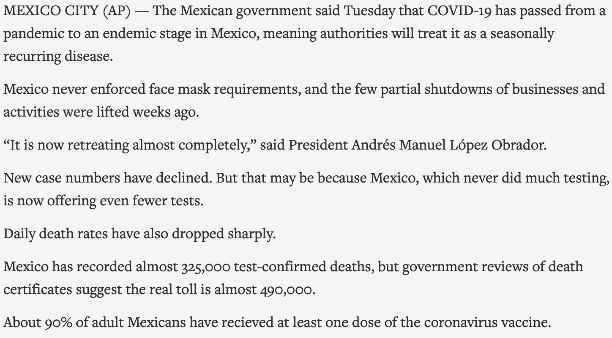

```{r preamble, echo=FALSE, message=FALSE, warning=FALSE}
library(dplyr)
library(ggplot2)
```

# Hoy

.large[

* Corpora y pre-procesamiento

* Utilidad de datos no estructurados

* La(s) leye(s) de Zipf

* Word embeddings y más allá

]

---

class: inverse, center

# Corpora y pre-procesamiento

---

# Corpora

* Por definición: Cualquier colección de datos

* Por uso: Colección de datos no estructurados, muchas veces de [gran]() tamaño


.footnote[
***

Lo que significa [gran]() varía en función a la naturaleza de los datos, y de cuándo son.]

---

# Associated Press Corpus 

Collection of 2246 news articles, mostly published around 1988

--

```{r, echo=FALSE}
library(tm)
library(knitr)
data("AssociatedPress", package = "topicmodels")

```


---

# Tokenización

--

Segmentar y transformar tu corpus para que represente las unidades de tu análisis.

Por ejemplo, palabras, morfémas, o caracteres.

---

# Tokenización a nivel de palabras

```{r, tidy = TRUE}
library(stringr)

first_par <- 'MEXICO CITY (AP) — The Mexican government said Tuesday that COVID-19 has passed from a pandemic to an endemic stage in Mexico, meaning authorities will treat it as a seasonally recurring disease.'

tokenized_first_par <- str_split(first_par, pattern = " ")[[1]]
tokenized_first_par
```

---

# Procesos de normalización de token(e)s

--

## Casing

Convertir todo el texto a minúscula (o mayúscula)

--

## Stemming

Quitar material morfológico, quedandose sólamente con las raíces


## Lematización

Cambiar palabras por sus respectivos lemas.

---

# Casing

```{r}
tolower(tokenized_first_par)
```

---

# Stemming & lemmatization

* cat, cats, cat's, cats'; ...

* to be; am; are; were; ...


---

# Tokenized AP

```{r, echo=FALSE}
library(tidytext)
AP_corpus <- tidy(AssociatedPress)
````

```{r, echo=FALSE}
head(AP_corpus)
```


---

class: inverse, center

# Zipf's Law of Abbreviation

.footnote[
***
Kanwal et al. (2017):  [Zipf’s Law of Abbreviation and the Principle of Least
Effort: Language users optimise a miniature lexicon for
efficient communication](). *Gesture*.
]

---

# Datos

```{r, echo=FALSE, warning=FALSE, message=FALSE}
df <- read.csv('https://tinyurl.com/2s3p9s2z')
head(df)
```

---


# Variables independientes (predictores)

* `trial`: 1, 2, ..., 31, 32

* `display`: 0, 1, 2, 3

<br>
--
<br>

```{r}
df$freq  <- ifelse(df$display %in% c(0,1),  'freq', 'infreq') 
```

* `freq`: infreq o freq
---

# Variable dependiente (resultado)
```{r}
df$short <- ifelse(df$label == 'zop', 1, 0)  
```

```{r, echo=FALSE, warning=FALSE, message=FALSE, fig.align='center', out.width='65%'}
library(ggplot2)

ggplot(df, aes(x = short)) + 
  geom_histogram(bins=30, col='black', fill= 'indianred') +
  theme_minimal(base_size=20) +
         xlab('Long expression                     Short expression') + 
        theme(axis.text.x = element_blank(),
              axis.ticks.x = element_blank())
```


---


# Variable dependiente (resultado)

```{r, echo=FALSE, warning=FALSE, message=FALSE}
df$short[1:10]
```


---
# Modelo lineal generalizado: Bernoulli / Binomial


$$\Huge y_i \sim \text{Bernoulli}(p_i)$$
<br>
$$\Huge p_i = f(\beta_0 + \beta_1 x_1 + ... \beta_n x_n)$$
--

<br>
$$\Huge f(x) = \text{inverse logit}(x)$$ 

---
# Logit y su inverso

$$\text{logit}(p) = \text{log}(\frac{p}{1-p})$$
<br>
$$\text{inverse logit}(p) = \frac{\text{exp}(p)}{1 + \text{exp}(p)}$$

```{r}
inv.logit <- function(x){
  return(exp(x) / (1 + exp(x)) )
}
```


---

# Espacio inverso logit

```{r, echo=FALSE, warning=FALSE, message=FALSE, fig.align='center', out.width='65%'}
x <- seq(-5,5)
y <- inv.logit(x)

d <- data.frame(x,y)

ggplot(data = d, aes(x,y)) + geom_point(col='indianred',size=3) + theme_minimal(base_size=20) + xlab('Suma de predictores') + ylab('Probabilidad') 
```


---

# Modelo lineal generalizado: Bernoulli


$$\Huge y_i \sim \text{Bernoulli}(p_i)$$
<br>
$$\Huge p_i = \text{inv.logit}(\beta_0 + \beta_1 x_1)$$
---

# Modelo lineal generalizado: Bernoulli


$$\Huge y_i \sim \text{Bernoulli}(p_i)$$
<br>
$$\Huge \text{logit}(p_i) = \beta_0 + \beta_1 x_1 + ... \beta_n x_n$$

---

# Regresión de Bernoulli (R)

```{r, warning=FALSE, message=FALSE, eval=FALSE}
glm(formula = short ~ 1 + freq,
    data    = df,
    family  = binomial(link = 'logit')
    )
```

---

class: inverse, center

# Zipf's Law of Abbreviation

.footnote[
***
Kanwal et al. (2017):  [Zipf’s Law of Abbreviation and the Principle of Least
Effort: Language users optimise a miniature lexicon for
efficient communication](). *Gesture*.
]

---


# Datos

```{r}
head(df)
```

---

# longitud de expresión ~ frecuencia de objeto

--

```{r, echo=FALSE, warning=FALSE, message=FALSE, fig.align='center', out.width='65%'}
ggplot(df, aes(x = short, fill = as.factor(freq))) +
         geom_histogram(bins=20, alpha=0.6, position='dodge') +
         theme_minimal(base_size=20) +
         xlab('Long expression            Short expression') + 
        theme(axis.text.x = element_blank(),
              axis.ticks.x = element_blank()) +
  scale_fill_discrete(name="Frequent object") 
```

---


# Modelo 1: Frecuencia

```{r, warning=FALSE, message=FALSE}
zipf_freq <- glm(formula = short ~ 1 + freq,
                       data    = df,
                       family  = binomial(link = 'logit')
                        )
coef(zipf_freq)
```

--

*** 
<br>
$$\Large \text{logit}(p_i) \approx 0.13 - (\text{infrec} \times 1.612) \approx -1.482 $$

---


# Modelo 1: Frecuencia
$$\Large \text{logit}(p_i) \approx 0.13 - (\text{infrec} \times 1.612) \approx -1.482 $$

<br><br>

```{r}
inv.logit(0.13 - 1.612)
inv.logit(0.13)        
```

---

# summary(zipf_freq)


```{r, echo=FALSE}
summary(zipf_freq)
```

---

# longitud de expresión ~ turno

--

```{r, echo=FALSE, warning=FALSE, message=FALSE, fig.align='center', out.width='65%'}
ggplot(df, aes(x = trial, fill=as.factor(short))) +
         geom_histogram(bins=20, alpha=0.8, position='dodge') +
         facet_wrap(~ as.factor(freq)) +
         theme_minimal(base_size=20) +
    scale_fill_discrete(name="Short form") 
```

---


# Modelo 2: Turno

```{r, warning=FALSE, message=FALSE}
zipf_trial <- glm(formula = short ~ 1 + trial,
                       data    = df,
                       family  = binomial(link = 'logit')
                        )
coef(zipf_trial)
```


---
# Predicciones

```{r}
inv.logit(-0.74 + (1  * 0.039))  
inv.logit(-0.74 + (20 * 0.039))
inv.logit(-0.74 + (32 * 0.039)) 
```

---

# summary(zipf_freq)


```{r, echo=FALSE}
summary(zipf_trial)
```

---


# Modelo 3: Ambos predictores

```{r}
zipf_trial_freq <- glm(formula = short ~ 1 + trial + freq,
                       data    = df,
                       family  = binomial(link = 'logit')
                        )
coef(zipf_trial_freq)
```

---

# Modelo 3: Ambos predictores

```{r, echo=FALSE}
summary(zipf_trial_freq)
```

---

# AICs

```{r}
zipf_freq$aic
zipf_trial$aic
zipf_trial_freq$aic
```

---


class: inverse, center

# Temas avanzados


---

# Interacciones
```{r}
m4 <- glm(formula = short ~ 1 + trial + freq + trial:freq,
                       data    = df,
                       family  = binomial(link = 'logit')
                        )
coef(m4)
```

---


# Modelos hierarquicos
```{r}
library(lme4)

m5 <- glmer(formula = short ~ 1 + trial + freq +
                              trial:freq +
                              (1 | IP),
                       data    = df,
                       family  = binomial(link = 'logit')
                        )
summary(m5)
```

---

class: inverse

# Próxima sesión

* No hay entrega inmediata

***

* **Visualización**

***

* Entrega parte II de "Revisión por pares": 24/05 - 31/05
