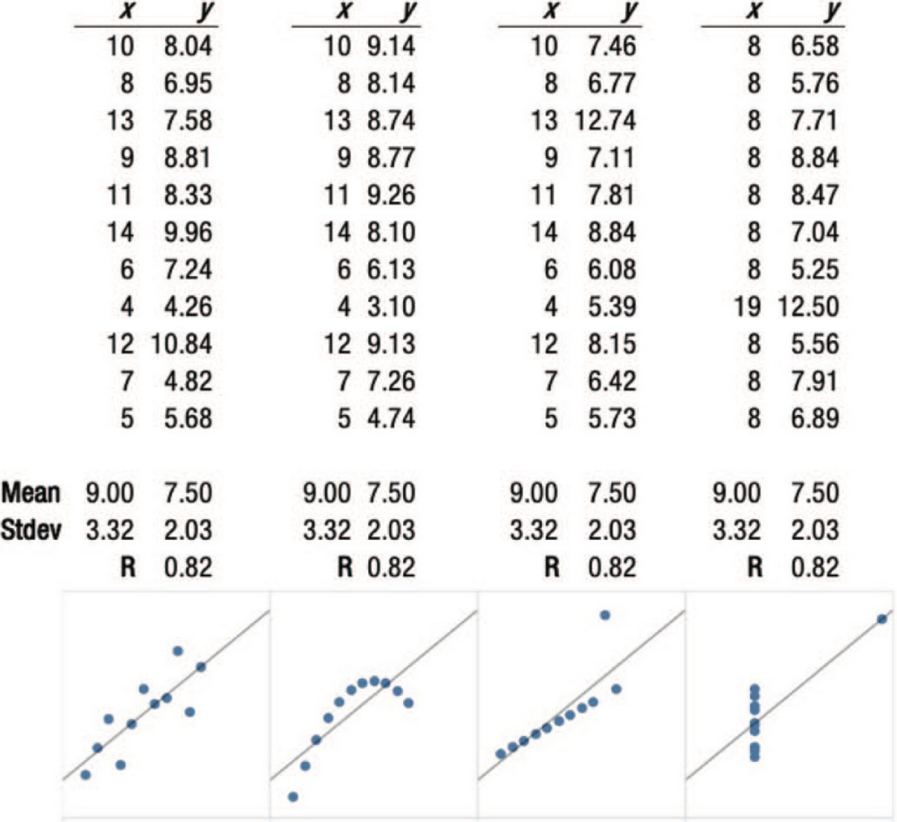
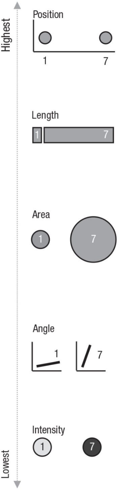

```{r preamble, echo=FALSE, message=FALSE, warning=FALSE}
library(dplyr)
library(ggplot2)
```

# Hoy

.large[
* Algunos tipos de visualización

* Principios de visualización

* ggplot2

* Recuperación: ejercicio práctico

]

---


class: inverse, center

# Algunos tipo de visualización

---

## Scatter plots (datos continuos; una sola relación)

```{r, warning=FALSE, message=FALSE, echo=FALSE, fig.align='center'}
set.seed(113)

age <- rpois(n = 30, lambda = 28)
pitch <- 220 + (-2 * age) + rnorm(30, 0,5)

df <- data.frame(age,pitch)
ggplot(df, aes(x = age, y = pitch)) + 
  geom_point() +
  theme_minimal(base_size = 22)
```

---

## Histogramas (distribución de una sola variable)


```{r, warning=FALSE, message=FALSE, echo=FALSE, fig.align='center'}

ggplot(df, aes(x = pitch)) +
  geom_histogram(bins = 10) +
  theme_minimal(base_size = 22)

```

---

## Boxplots  (distribución de una sola variable [grupos])

```{r, warning=FALSE, message=FALSE, echo=FALSE, fig.align='center'}
df_gestures <- read.csv('https://tinyurl.com/gestures-data') #download data

ggplot(df_gestures, aes(x = language, y = gestures)) +
  geom_boxplot() +
  theme_minimal(base_size = 22) +
  theme(axis.title.x = element_blank())
```

---

## Boxplots  (distribución de una sola variable [grupos])

```{r, warning=FALSE, message=FALSE, echo=FALSE, fig.align='center'}
df_gestures <- read.csv('https://tinyurl.com/gestures-data') #download data

ggplot(df_gestures, aes(x = language, y = gestures, fill = context)) +
  geom_boxplot() +
  theme_minimal(base_size = 22) +
  theme(axis.title.x = element_blank())
```

---

# El cielo es el límite

[https://r-statistics.co/Top50-Ggplot2-Visualizations-MasterList-R-Code.html](https://r-statistics.co/Top50-Ggplot2-Visualizations-MasterList-R-Code.html)


---


class: inverse, center

# Principios de visualización


---




.footnote[
*** 
Fig. 1 de Franconeri et al. 2021 [The Science of Visual Data Communication: What Works](https://journals.sagepub.com/stoken/default+domain/10.1177%2F15291006211051956-FREE/full#_i28)]

---

# Tres heurísticas

1. Objetivo: La visualización tiene un objetivo bien definido

--

2. Claridad: Los datos son visualizados de manera clara (y simple)

--

3. Mensaje: Haz que el mensaje sea inmediato/evidente

---

.pull-left[# Canales visuales 
### ranking por nitidez cognitiva

###  1:7
]


---


# Accesibilidad y doble codificación


.footnote[
*** 
Fig. 2 de Franconeri et al. 2021 [The Science of Visual Data Communication: What Works](https://journals.sagepub.com/stoken/default+domain/10.1177%2F15291006211051956-FREE/full#_i28)]

---

# Recomendaciones

* Utiliza visualización para guiar la computación de estadísticas

--

* Limíta el número de comparaciones por gráfico

--

* En caso de duda: Minimalismo

--

* Respeta direccionalidad "natural", si la hay

--

* Cuidado con ilusiones visuales

---

## Guia computación de estadísticas 

```{r, warning=FALSE, message=FALSE, echo=FALSE, fig.align='center'}


ggplot(df, aes(x = age, y = pitch)) + 
  geom_point() +
  geom_smooth(method= 'lm') + 
  theme_minimal(base_size = 22)
```

---

## Guia computación de estadísticas 

```{r, warning=FALSE, message=FALSE, echo=FALSE, fig.align= 'center'}
df_gestures <- read.csv('https://tinyurl.com/gestures-data') #download data

ggplot(df_gestures, aes(x = language, y = gestures)) +
  geom_boxplot() +
  theme_minimal(base_size = 22) +
  theme(axis.title.x = element_blank())

```
---

## Número de comparaciones por gráfico (I/II)

```{r, warning=FALSE, message=FALSE, echo=FALSE, fig.align= 'center'}
df_gestures <- read.csv('https://tinyurl.com/gestures-data') #download data

ggplot(df_gestures, aes(x = language, y = gestures)) +
  geom_boxplot() +
  theme_minimal(base_size = 22) +
  theme(axis.title.x = element_blank())
```

---

## Número de comparaciones por gráfico (II/II)

```{r, warning=FALSE, message=FALSE, echo=FALSE, fig.align= 'center'}
df_gestures <- read.csv('https://tinyurl.com/gestures-data') #download data

ggplot(df_gestures, aes(x = language, y = gestures, fill = context)) +
  geom_boxplot() +
  theme_minimal(base_size = 22) +
  theme(axis.title.x = element_blank())
```


---

## Mínimalismo vs Maximalismo (I/III)

```{r, warning=FALSE, message=FALSE, echo=FALSE, fig.align= 'center'}
ggplot(df_gestures, aes(x = language, y = gestures)) +
  geom_boxplot() +
  theme_minimal(base_size = 22) +
  theme(axis.title.x = element_blank())
```

---

## Mínimalismo vs Maximalismo (II/III)


```{r, warning=FALSE, message=FALSE, echo=FALSE, fig.align= 'center'}
ggplot(df_gestures, aes(x = language, y = gestures, fill = context)) +
  geom_boxplot() +
  theme_minimal(base_size = 22) +
  theme(axis.title.x = element_blank())
```

---

## Mínimalismo vs Maximalismo (III/III)


```{r, warning=FALSE, message=FALSE, echo=FALSE, fig.align= 'center'}

m <- lm(gestures ~ language, df_gestures)

ggplot(df_gestures, aes(x = language, y = gestures, fill = context)) +
  geom_boxplot() +
  theme_minimal(base_size = 22) +
  geom_abline(intercept = coef(m)[[1]], slope = coef(m)[[2]], linetype = 2, size=1.5) +
    stat_summary(fun.y=mean, geom="point", shape=20, size=14, color="blue", fill="blue") +
  theme(axis.title.x = element_blank()) 

```

---

# Direccionalidad "natural" (I/II)

```{r, warning=FALSE, message=FALSE, echo=FALSE, fig.align= 'center'}

ggplot(df, aes(x = age, y = pitch)) + 
  geom_point() +
  geom_smooth(method= 'lm') + 
  theme_minimal(base_size = 22) + scale_y_reverse()
```

---

# Direccionalidad "natural" (II/II)

```{r, warning=FALSE, message=FALSE, echo=FALSE, fig.align= 'center'}

ggplot(df, aes(x = age, y = pitch)) + 
  geom_point() +
  geom_smooth(method= 'lm') + 
  theme_minimal(base_size = 22) + scale_x_reverse()

df$gender <- 'F'
pitch <- df$pitch + 0.8
gender <- rep('M', nrow(df))
age <- df$age
df <- df %>% rbind(data.frame(pitch,age,gender))
```

# Ilusiones visuales

```{r, warning=FALSE, message=FALSE, echo=FALSE, fig.align = 'center'}


library(scales)
ggplot(df, aes(y = pitch, x = gender)) + geom_bar(position = 'dodge', stat= 'identity') +  scale_y_continuous(limits=c(183,184.5),oob = rescale_none) +
  theme_minimal(base_size = 22) + theme(axis.title.x = element_blank())

```

---

class: inverse

# ggplot2
---

class: inverse

# Recuperación: ejercicio práctico

---

class: inverse

# Próxima sesión

* (Recuperación ejercicio práctico)

***

* **Más temas y más métodos empiricos en las ciencias del lenguaje**

***

* Informe final: 28/06
