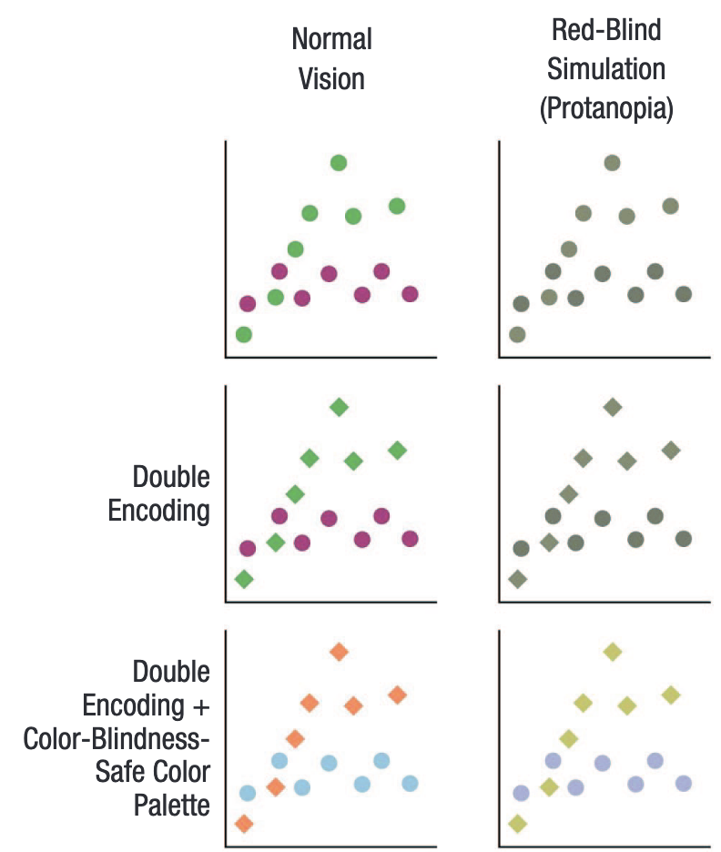

```{r preamble, echo=FALSE, message=FALSE, warning=FALSE}
library(dplyr)
library(ggplot2)
```

# Hoy

.large[
* Principios de visualización

* ggplot2

]

---

class: inverse, center

# Principios de visualización


---


---


.footnote[
*** 
Fig. 1 de Franconeri et al. 2021 [The Science of Visual Data Communication: What Works](https://journals.sagepub.com/stoken/default+domain/10.1177%2F15291006211051956-FREE/full#_i28)]

---

# Tres heurísticas

1. Objetivo: La visualización tiene un objetivo bien definido

2. Claridad: Los datos son visualizados de manera clara (y simple)

3. Mensaje: Haz que el mensaje sea inmediato/obviou

---

.pull-left[## Canales visuales 
##ranking por nitidez 

##cognitiva 1:7
]


---


# Accesibilidad y doble codificación



.footnote[
*** 
Fig. 2 de Franconeri et al. 2021 [The Science of Visual Data Communication: What Works](https://journals.sagepub.com/stoken/default+domain/10.1177%2F15291006211051956-FREE/full#_i28)]

---

# Recomendaciones

* Utiliza visualización para guiar a la computación de estadísticas

* Limíta el número de comparaciones por gráfico

* Si estáis en duda: Minimalismo

* Respetad direccionalidad "natural", si la hay

* Cuidado con ilusiones visuales

---

## Guia computación de estadísticas 

```{r, warning=FALSE, message=FALSE, echo=FALSE, fig.align='center'}
age <- rpois(n = 30, lambda = 28)
pitch <- 220 + (-2 * age) + rnorm(30, 0,5)
df <- data.frame(age,pitch)

ggplot(df, aes(x = age, y = pitch)) + 
  geom_point() +
  geom_smooth(method= 'lm') + 
  theme_minimal(base_size = 22)
```

---

## Guia computación de estadísticas 

OTRO EJEMPLO: GESTOS Y COMPARACIÓN DE GRUPOS, con solo CAT/COR

---

## Comparaciones por gráfico

OTRO EJEMPLO: GESTOS Y COMPARACIÓN DE GRUPOS ahora CAT/COR y CONTX

---

class: inverse

# Próxima sesión

* No hay entrega

***

* **Más temas y métodos empiricos en las ciencias del lenguaje**

***

* Informe final: 28/06
