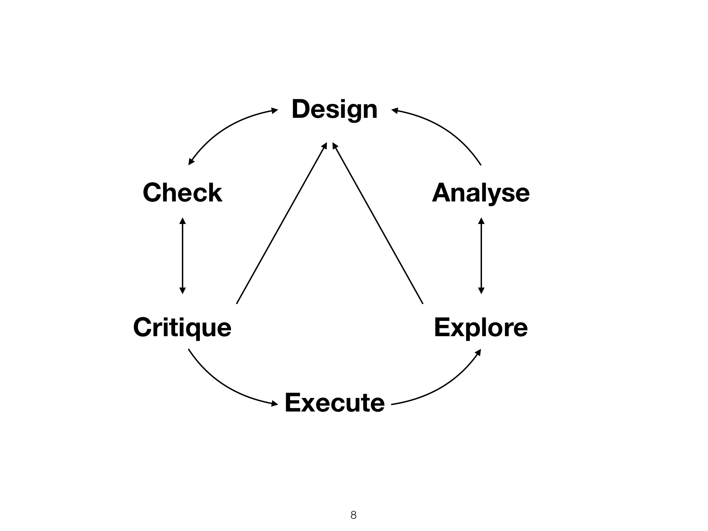

```{r preamble, echo=FALSE, message=FALSE, warning=FALSE}
library(dplyr)
library(ggplot2)
```

# Hoy

.large[
* Recapitulación

* Más allá: Métodos empiricos inferenciales

* Más allá: Ciencias del lenguaje empiricas


]

---


class: inverse, center

# Recapitulación

---

# Ciclo de análisis




---


# Análisis inferencial vs. descriptivo

--

.large[
* Inferencia de propiedades (más allá de la muestra) 

* Predicción

* Comparación

* Causa-efecto 
]


---


.footnote[
*** 
Fig. 1 de Franconeri et al. 2021 [The Science of Visual Data Communication: What Works](https://journals.sagepub.com/stoken/default+domain/10.1177%2F15291006211051956-FREE/full#_i28)]

---

### Replicabilidad

Que se puedan obtener resultados consistentes con los mismo datos de entrada; pasos computacionales; métodos; código; y condiciones de análisis

***
--


### Reproducibilidad

Que se puedan obtener resultados consistentes en diferentes análisis que buscan responder la misma pregunta, cada cual con sus propios datos

---

# Diseño de análisis (componentes)

* Pregunta(s) del análisis

* Plan de diseño

* Plan de muestreo (sampling plan)

* Especificación de variables

* Plan de análisis

---

## Terminología: Tipos de variables

* **Nominales** (género; idioma materno; lugar de origen)

* **Ordinales** (años cursados; edad)

* **Binarias** 

* **Booleanas** (verdadero/falso)

* **Métricas** (número de usos de pronombres; tono)

---

## Terminología: Tipos de muestras
**Muestra completa**: 
toda la población  de interés 
<br>
<br>
--
**Muestra representativa/sin sesgo**: tomada de la muestra completa con un método que no depende de la muestra que se está tomando
<br>
<br>
--
**Muestra no representativa/con sesgo**: los datos son influenciados por el método de toma

---

## Terminología: Distribuciones

* Gaussiana/Normal

* Poisson

* Bernoulli (Binomial)


---


# Ciclo de análisis


---

# Control y crítica

* Estudios piloto

* Simulaciones

---


# Ciclo de análisis


---

# Exploración

* (Manipulación)

* Estadística descriptiva

* Visualización

---

# Análisis

* Regresión lineal generalizada con uno o más predictores

  * Normal/Gaussiana
  
  * Poisson
  
  * Bernoulli

* Visualización

* Análisis de corpus

---

# Fenómenos

* Tono

* Gestos

* Ambigüedad temporal

* Resolución de pronómbres

* Leyes de Zipf (laboratorio y gran escala)

* ...

---


class: inverse

# Más allá: Métodos empiricos inferenciales

---

class: inverse

# Más allá: Ciencias del lenguaje empiricas

---

class: inverse

# Coda

* Informe final: 28/06
