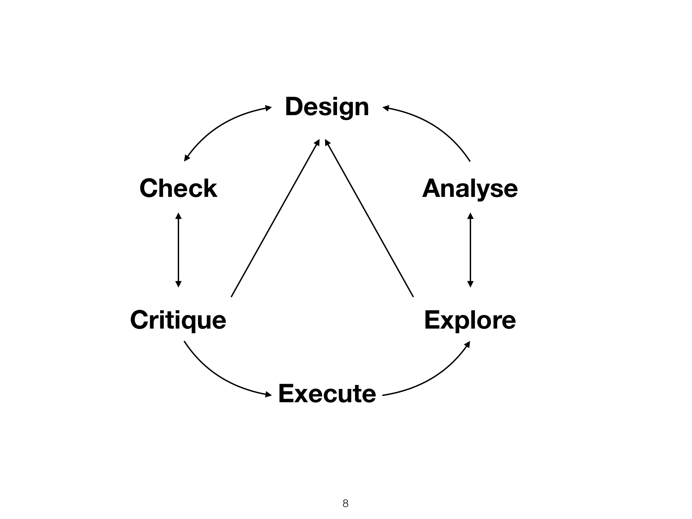

```
## 
## Attaching package: 'dplyr'
```

```
## The following objects are masked from 'package:stats':
## 
##     filter, lag
```

```
## The following objects are masked from 'package:base':
## 
##     intersect, setdiff, setequal, union
```


# Organizational matters

  * Website & material: [https://metodesempirics.github.io/](https://metodesempirics.github.io/)
  * 5 ECTS (~125-150 hours of work)
  * Assignments due before DD, HH:MM
  * Evaluation^[Failing the "analysis design and execution" the first time entails saving the remainder activities with a 40% of value on the final grade. The mid-term exam will be recovered through another exam. The re-sit of the "analysis design and execution" will also be an exam."]:
    * Weekly assignments (20%, not recoverable)
    * Peer-review (20%, not recoverable)
    * Mid-term exam (20%, recoverable)
    * Analysis design and execution (40%, recoverable)

For each session, you will find:
  * A rendered HTML file 
  * A rendered slide-set 
  * A dynamic file 
  * An assignment 


# Overview

This class covers empirical methods for language sciences. The main goal is for you to understand and take control of the full cycle of (linguistic) analysis: planning; collection; processing; exploration; visualization; and analysis. By contrast to previous classes, you will also be introduced to *inferential* statistics.

## Research cycle



## Inferential statistics

Methods to not only describe or summarize the observed data (descriptive statistics) but to generalize to unobserved data and make predictions.

# Evaluation

## Weekly assignments
  * Submitted through Aula Global
  * Graded automatically
  * Max. 2 attempts
  * 6 in total

## Peer review
  * You give your peers (blind) feedback about their planned analysis
  * Fail/pass only. You fail if you do not submit a review; or if your review fails in being --to a minimal degree-- decent and constructive
  * 2 in total

## Mid-term exam
  * Submitted through Aula Global
  * Graded automatically
  * Single attempt

## Analysis design and execution
  * A report of analysis designed and executed by yourself
  * Can be done in groups. But a clear division of labor between members needs to be decided **and approved**
  * Here's a template: **nn**
  * Evaluation criteria (100 points max)
    * Clarity: the analysis is clearly and succintly described; appropriate use of visual devices (30 points)
    * Replicability: the analysis plan covers all steps to allow for its replication (15 points)
    * Content: the analysis is well motivated and executed using the appropriate techniques (40 points)
    * Reproduceability: the analysis provides all the material necessary to reproduce it (15 points)
    * Creativity: The analysis goes above and beyond in one or multiple dimensions: e.g., visual devices; research question; methodology; documentation (20 points)


# Replicability and reproduceability
These terms are used differently --and sometimes interchangeably-- across the literature. However, they tend to check most of the same boxes. For our purposes, we follow \cite{national:2019} define them as:

  * Replicability:


# Some open issues
1. There are different ways to compute the relatedness of items from MN and SWOW. One possibility is to adapt the three transformations proposed for SWOW-EN (@deDeyne+etal:2016,@deDeyne+etal:2018), for MN. This would yield three relatedness measures for naming and three for associativity. There surely are other ways to be able to quantify how "related" two names are, so this requires some thinking
2. Decide on best way to rank models across benchmarks. One option is to go hierarchical: conceptualize each task as drawing from a "population" of semantically-relevant tasks. The other is to evaluate each task (or transformation thereof) separately (as done, e.g., in @deDeyne+etal:2018). This would be simple if it happened to be the case that that model ranks are constant across benchmarks.

# Analysis 1: Comparison of resources across benchmarks
If measuring prediction: One model per resource; or one hierarchical model for all benchmarks. Alternatively, just go for correlations.

Goals:

  1. Use model comparison to pick best transformation for associativity and MN
  2. See how well each resource does when benchmarked against human judgments
  3. Reflect on what this tells us about the information they codify

# Analysis 2: Structural comparison

  1. How similar are these matrices as a whole? This gives us a general idea of similarities and differences across resources. The main work to be done here is to qualitatively work out where they may differ/be similar (in advance!) + identify clusters of interesting cases to compare, if any.
  2. Possibly look at how well each resource approximates each other. That is, if I were to give you naming data; and I simplified the data into $k$-levels of complexity, how well does each level of complexity generate the associativity data; and vice-versa.

***


```
## Error: 'data/local/swow/swow-rw-common.csv' does not exist in current working directory ('/Users/brox/MetodesEmpirics.github.io/material/2022q3/session01').
```

```
## Error: 'data/local/mn/mn-rw-common.csv' does not exist in current working directory ('/Users/brox/MetodesEmpirics.github.io/material/2022q3/session01').
```

```
## Error: 'data/local/distributional/distr_long.csv' does not exist in current working directory ('/Users/brox/MetodesEmpirics.github.io/material/2022q3/session01').
```

```
## Error in as.matrix(swow[, 2:dim(swow)[2]]): object 'swow' not found
```

```
## Error in is.data.frame(x): object 'mx_swow' not found
```

```
## Error in as.matrix(mn[, 2:dim(mn)[2]]): object 'mn' not found
```

```
## Error in is.data.frame(x): object 'mx_mn' not found
```

```
## Error in as.matrix(distr[, 2:dim(distr)[2]]): object 'distr' not found
```

```
## Error in is.data.frame(x): object 'mx_distr' not found
```

# Technical notes (to be ignored for now)

* The graph that underlies the calculation of strength, PPMI and RW for SWOW is the largest strongly connected component of the raw cue-response values. In this way, only words with incoming and outcoming edges are retained and there is a path connecting all possible word pairs in the network. This is sensible because words are used both as cues and responses.

* By contrast, the calculation of strength, PPMI and RW for ManyNames needs to be different. These are name-image counts. Consequently, images have incoming edges (words used to label them) but no outgoing ones. Option one: use the largest weakly connected component to calculate MN relations. Current proposal: use largest strongly connected component by first associating image IDs with their topnames; aggregating names across identical topnames; and then proceeding as with SWOW. This is conceptually a bit odd because names are aggregated based on top names. But the network is a lot denser and it arguably still captures the intuition of an "image mediated measure"

# Trivia notes (to be ignored for now)


* Using image_ids and the largest weakly connected component, there are 539 words common between SWOW, MN, and fastText. In this case, fastText only doesn't know one word present in both MN and SWOW: *old man*.

* Using top_names and the largest strongly connected component, there are 270 words in common between SWOW, MN, and fastText. In this case, fastText knows all the words


```
## [1] "Top 5 neighbors for a sample of MN-RW"
```

```
## Error in select(., X1, !!as.name(word)): object 'mn' not found
```

```
## Error in select(., X1, !!as.name(word)): object 'mn' not found
```

```
## Error in select(., X1, !!as.name(word)): object 'mn' not found
```

```
## Error in select(., X1, !!as.name(word)): object 'mn' not found
```

```
## Error in select(., X1, !!as.name(word)): object 'mn' not found
```

```
## [1] "### ### ###"
```

```
## [1] "Top 5 neighbors for a sample of SWOW-RW"
```

```
## Error in select(., X1, !!as.name(word)): object 'swow' not found
```

```
## Error in select(., X1, !!as.name(word)): object 'swow' not found
```

```
## Error in select(., X1, !!as.name(word)): object 'swow' not found
```

```
## Error in select(., X1, !!as.name(word)): object 'swow' not found
```

```
## Error in select(., X1, !!as.name(word)): object 'swow' not found
```

```
## [1] "### ### ###"
```

```
## [1] "Top 5 neighbors for a sample of word embeddings"
```

```
## Error in select(., X1, !!as.name(word)): object 'distr' not found
```

```
## Error in select(., X1, !!as.name(word)): object 'distr' not found
```

```
## Error in select(., X1, !!as.name(word)): object 'distr' not found
```

```
## Error in select(., X1, !!as.name(word)): object 'distr' not found
```

```
## Error in select(., X1, !!as.name(word)): object 'distr' not found
```
