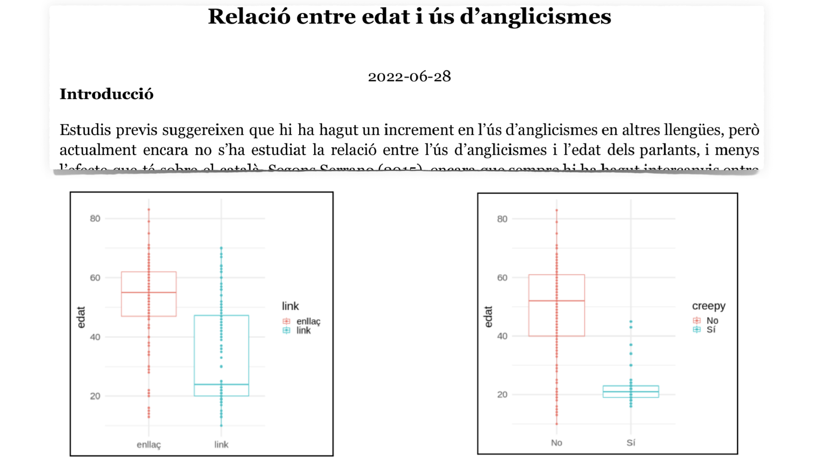
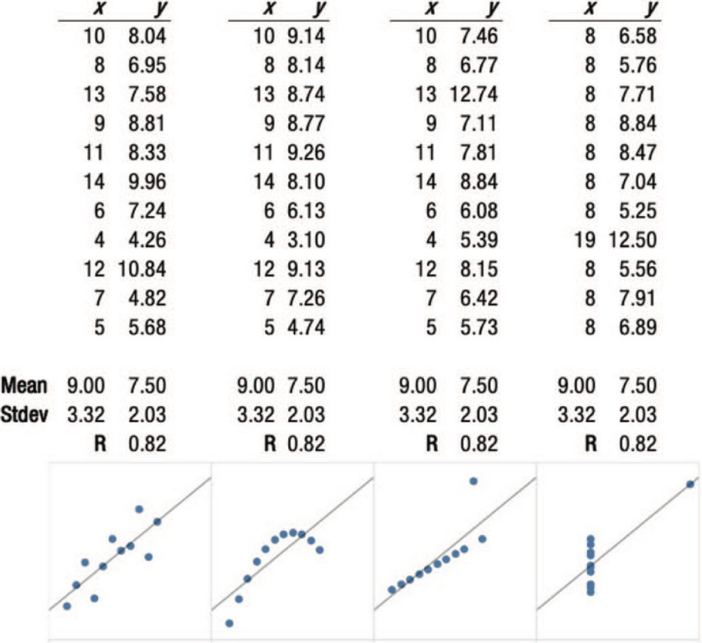

```{r preamble, echo=FALSE, message=FALSE, warning=FALSE}
library(dplyr)
library(ggplot2)
```

# Avui

.large[
* Organització del curs

* Sinopsi: Disseny d'anàlisi i estadística inferencial

* Replicabilitat i reproduïbilitat

* R

* Resum: Estadística descriptiva

]

---

class: inverse, center

# Organització

---

# Informació bàsica

.large[
* 5 ECTS (~125-150 hores)

* Material i comunicació: https://aulaglobal.upf.edu/

* Equip
   * Thomas Brochhagen (thomas.brochhagen@upf.edu)
  
   * Guillermo Montaña (guillermo.montana@upf.edu)

* Estructura
   * Dimarts: Conceptes i discussió
  
   * Divendres: Pràctica i més discussió

]

---

# Avaluació
.large[
* Exercicis setmanals (20%, no recuperable)

* Exercici pràctic (20%, recuperable)

* Revisió per parells (10%, no recuperable)

* Informe: disseny i execució d'anàlisi (50%, recuperable)
]
---

# Avaluació

.large[
* Exercicis setmanals (20%, no recuperable; take home)
   * A través d'Aula Global
  
   * Correcció automàtica
  
   * 5 en total
]

---

# Avaluació

.large[
* Exercici pràctic (20%, recuperable; take home)

   * A través d'Aula Global
  
   * A meitat de curs

]

---

# Avaluació 
.large[
* Revisió per parells (10%, no recuperable)

   * Només opció d'aprovar, o no

   * No s'aprova si no es lliuren els dos documents; o si qualsevol no s'adequa a un estàndard mínim de qualitat
]

---

# Avaluació

.large[
Disseny i execució d'anàlisi (50%)
* Individual o en grups

* Avaluació en funció a criteris (a baix) i mida del grup

]

***

--
.large[
**Criteris** (max. 100 punts)
* Claredat (40): descripció clara i al punt; ús adequat de visualització
  
* Replicabilitat (10)
  
* Reproduïbilitat (10)
  
* Contingut (40): l'anàlisi està ben motivada i executada amb mètodes adequats

* Creativitat (10): supera expectatives en una o múltiples dimensions, com visualització, temàtica, metodologia, documentació
]

---




---

# Altres exemples

* Carrota vs. pastanaga en el territori alt empordanès (català septentrional de transició)

* S'ha substituït més de pressa el dialecte balear pel central que el nord-occidental en venir a Barcelona?

* Intercomprensión románica o plurilingüísmo: análisis de identificación de lenguas

* Evaluating linguistic laws on the Harry Potter saga

* Ús i freqüència de connectors: novel·la vs. text científic

* ...

---

class: inverse, center

# Sinopsi: Disseny d'anàlisi i estadística inferencial

---

# Cicle d'anàlisi


---

# Sessions

.pull-left[
* Disseny (1-3)

* Control (3)

* Crítica (3-9)

* Execució (3)

* Exploració (3-9)

* Anàlisi (4-9)
]

---

# A efectes pràctics
.large[
* Manipulació i interpretació de dades

* Comparació de grups

* Predicció

* Visualització

* (Programació)
<br><br>

.center[... aplicat a ciències del llenguatge]
]

---

class: center, inverse

# Anàlisi inferencial


---


# Anàlisi inferencial (vs. descriptiu)
.large[
* Inferència de propietats més enllà de la mostra

* Predicció

* Comparació

* Causa-efecte

]
---



.footnote[
*** 
Fig. 1 de Franconeri et al. 2021 [The Science of Visual Data Communication: What Works](https://journals.sagepub.com/stoken/default+domain/10.1177%2F15291006211051956-FREE/full#_i28)]
---

# Exemples
Estimació de l'efecte d'un o més *predictores* en un *resultat*

* Fluidez en una segona llengua a base de la primera
  
* Probabilitat de l'ús d'un pronombre a la base del seu entorn lingüístic
  
* Mida d'una paraula en funció a la seva freqüència

*...
  
<br>
***

<br>

--

Estimació de diferències entre grups

* Comparació d'un mètode d'aprenentatge de la llengua contra un altre
  
* Comparación de políticas lingüísticas

*...


---
class: inverse, center

# Replicabilitat i reproduïbilitat

---

# Crisi de replicabilitat i reproduïbilitat

.left[Replication is one of the central issues in any empirical science. 

To confirm results or hypotheses by a repetition procedure is at the basis of any scientific conception. A replication experiment to demonstrate that the same findings can be obtained in any other place by any other researcher is conceived as an operationalization of objectivity. 

It is the proof that the experiment reflects knowledge that can be separated from the specific circumstances (such as time, place, or persons) under which it was gained.
<br><br>
-Stefan Schmidt 
]

---

### Replicabilitat

Que es puguin obtenir resultats consistents amb les mateixes dades d'entrada; passos computacionals; mètodes; codi; i condicions d'anàlisi

***
--


### Reproduïbilitat

Que es puguin obtenir resultats consistents en diferents anàlisis que busquen respondre la mateixa pregunta, cadascú amb les seves pròpies dades

---

# Crisi de replicabilitat i reproduïbilitat

* Una quantitat important de resultats no s'han pogut ni replicar ni reproduir (50%-80%, depenent del camp)

--

* Va comportar un gran canvi en metodologia i documentació (estem en això)

--

* Independentment, és central documentar totes les teves decisions i manipulacions; de principi a fi

--

* Llengües de programació són una eina ideal per
   * conduir anàlisi empírica, i
  
   * assegurar-se que sigui replicable

---

class: inverse, center

# R 

---


```{r, echo=TRUE, warning=FALSE, eval=TRUE, message=FALSE,fig.align='center',out.width='100%'}
x = c(5, 3, 8, 4) # vector of values

mean(x)           # mean of x   
```

---
# En aquest curs

* Ús rudimentari i interactiu

* Principalment: intuïció sobre estructures de dades i la seva manipulació

* Manera d'assegurar replicabilitat

* Manera de millorar comunicació

---

class: inverse, center

# Resum: Estadística descriptiva

---

# Estadística descriptiva


.large[
* Tendències centrals (mitja; mitjana; moda)

* Dispersió (variança; desviació típica)

* Variació conjunta (correlació, covariança)
]

.footnote[

***

Si falta una revisió: Franke (2021) [*An Introduction to Data Analysis*, capítol 5](https://michael-franke.github.io/intro-data-analysis/Chap-02-03-summary-statistics. html)
]

---

class: inverse
# Propera sessió

* Lliurament de "Assignment 1" (08:00 AM 21/04)

* Si n'hi ha, preguntes generals sobre el curs

* Si n'hi ha, preguntes generals sobre l'informe

* Si n'hi ha, preguntes generals sobre R

***

* **Disseny d'anàlisi**

