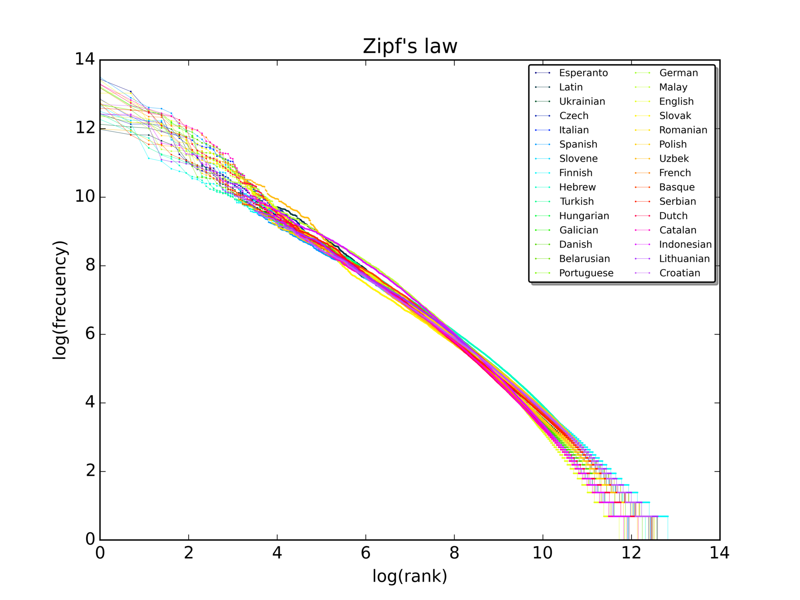
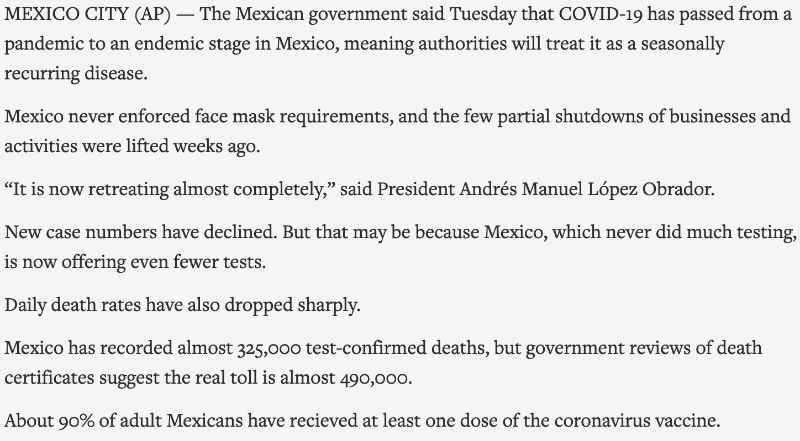
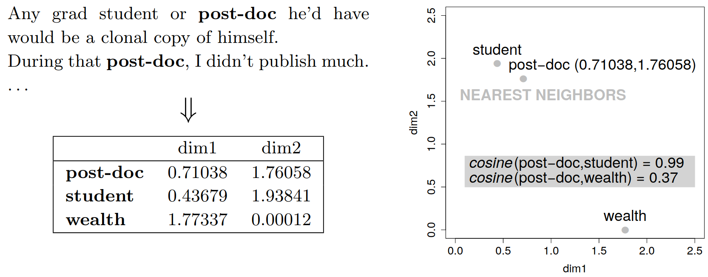
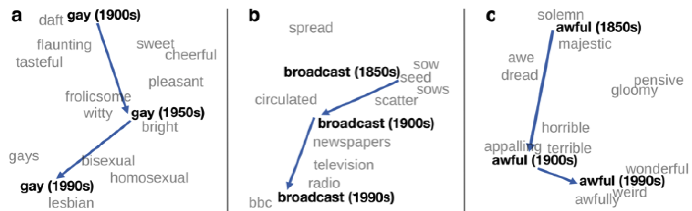

```{r preamble, echo=FALSE, message=FALSE, warning=FALSE}
library(dplyr)
library(ggplot2)
```

# Avui

.large[
* Les lleis de Zipf

* Corpora i pre-processament

* Aplicacions

* Word embeddings i més enllà

]

---

class: inverse, center

# Les lleis de Zipf


.footnote[
***

G.K. Zipf (1935) *The psycho-biology of language*⠀⠀⠀⠀⠀⠀⠀⠀⠀⠀⠀

G.K. Zipf (1949) *Human behavior and the principle of least effort*

]

---

### 1. Zipf's (Rank-Frequency) Law

### 2. Zipf's Law of Abbreviation

### 3. Zipf's Meaning-Frequency Law

---

### Rank-Frequency Law: La distribució rang-freqüència de paraules és inversa

```{r, echo=FALSE, fig.align='center', out.width='90%'}
library(knitr)

```

---

### Law of Abbreviation: Formes freqüents tendeixen a ser més curtes


```{r, echo=FALSE, out.width="80%", fig.align='center'}
include_graphics('en-zipf.jpg')
```

---

### Meaning-frequency Law: Formes freqüents tendeixen a tenir més significats

```{r, echo=FALSE, fig.align='center'}
library(ggplot2)
freqs <- seq(1:100)
meanings <- freqs**0.5
df <- data.frame(freq = freqs,
                 nmeanings = meanings)

ggplot(df, aes(x = freq, y = nmeanings)) + geom_point() +     xlab('Freqüència') + ylab('Nombre de significats') + theme_minimal(base_size=22) +
 theme(axis.text.y = element_blank(), axis.text.x = element_blank()) 

```

---

class: inverse, center

# Corpora i pre-processament

---

# Corpora

* Per definició: Qualsevol col·lecció de dades

* Per ús convencional: Col·lecció de dades no estructurades, moltes vegades de [gran]() tamany


.footnote[
***

El que significa [gran]() varia en funció de la naturalesa de les dades, i de quan són / és l'anàlisi.]

---

# Associated Press Corpus 

Col·lecció de 2246 articles de notícies, la majoria del voltant de 1988

--

```{r, echo=FALSE, warning=FALSE, message=FALSE}
library(tm)
library(knitr)
data("AssociatedPress", package = "topicmodels")

```


---

<br><br><br><br>
<div class="warning" style='padding:0.1em; background-color:#E9D8FD; color:#69337A'>
<span>
<p style='margin-top:1em; text-align:center'>
<b>Què hauríem de fer per poder analitzar aquestes dades? Per exemple, per comprovar si es compleix la llei de Zipf</b>
</p>
</p></span>
</div>


---

# Tokenització

--

Segmentar i transformar el teu corpus perquè representi les unitats de la teva anàlisi.

Per exemple, paraules, morfémes, o caràcters.

---

# Tokenització a nivell de paraules

```{r}
library(stringr)

first_par <- 'MEXICO CITY (AP) — The Mexican government said Tuesday that COVID-19 has passed from a pandemic to an endemic stage in Mexico, meaning authorities will treat it as a seasonally recurring disease.'

tokenized_first_par <- str_split(first_par, pattern = " ")[[1]]
tokenized_first_par
```

---

# Processos de normalització de tokens

--

## Casing

Convertir tot el text a minúscula (o majúscula)

--

## Stemming

Treure material morfològic, quedant-se només amb les arrels
--


## Lematización

Canviar paraules pels respectius lemes.

---

# Casing

```{r}
tolower(tokenized_first_par)
```

---

# Stemming & lemmatization

* cat, cats, cat's, cats'; ...

* to be; am; are; were; ...


---

# AP tokenitzada


```{r, eval=FALSE}
library(tidytext)

data("AssociatedPress", package = "topicmodels")
tidy(AssociatedPress)
```

```{r, echo=FALSE}
library(tidytext)
AP_corpus <- tidy(AssociatedPress)
```

```{r, echo=FALSE}
head(AP_corpus)
```

---

# AP i Zipf?

```{r, echo=FALSE}
AP_ranked <- AP_corpus %>% select(term, count) %>% group_by(term) %>% mutate(count = sum(count)) %>% unique() %>% arrange(desc(count)) %>% ungroup() %>% mutate(length = nchar(term))
AP_ranked$rank <- seq(1:nrow(AP_ranked))
AP_ranked <- AP_ranked %>% mutate(log.count = log(count),
                                  log.rank = log(rank))
AP_ranked %>% head()
```

---

# AP i Zipf I

```{r, echo=FALSE, fig.align='center'}
ggplot(AP_ranked, aes(x = log.rank, y = log.count)) + geom_point(col='indianred') + theme_minimal(base_size = 22) + 
  xlab('log(rang)') + ylab('log(freq)')
```

---

# AP i Zipf II

```{r, echo=FALSE, fig.align='center'}
ggplot(AP_ranked, aes(x = length, y = count)) + geom_point(col='indianred') + theme_minimal(base_size = 22)  + 
  xlab('longitud (caràcters)') + ylab('freq')
```

---

# Jane Austen

```{r, echo=FALSE}
library(janeaustenr)

original_books <- austen_books() %>%
  group_by(book) %>%
  mutate(line = row_number(),
         chapter = cumsum(str_detect(text, regex("^chapter [\\divxlc]",
                                                 ignore_case = TRUE)))) %>%
  ungroup()

original_books

```

---

# Jane Austen tokenitzada i normalitzada

```{r, echo=FALSE}
tidy_books <- original_books %>%
  unnest_tokens(word, text)
tidy_books
```


---

# Jane Austen i Zipf?

```{r, echo=FALSE}
JA_ranked <- tidy_books %>% select(word) %>% count(word) %>% arrange(desc(n)) %>% rename(count = n) %>% mutate(length = nchar(word),
                                                                                                               log.count = log(count))
JA_ranked$rank <- seq(1:nrow(JA_ranked))
JA_ranked <- JA_ranked %>% mutate(log.rank = log(rank))
head(JA_ranked)
```

---


# Jane Austen i Zipf I

```{r, echo=FALSE}
ggplot(JA_ranked, aes(x = log.rank, y = log.count)) +  geom_point(col='indianred') + theme_minimal(base_size = 22)  + 
  xlab('log(rang)') + ylab('log(freq)')
```

---

# Jane Austen i Zipf II

```{r, echo=FALSE}
ggplot(JA_ranked, aes(x = length, y = count)) +  geom_point(col='indianred') + theme_minimal(base_size = 22)  + 
  xlab('longitud') + ylab('freq')
```

---

# I l'altra llei de Zipf?


---

# Discussió

* Tot tipus de text segueix les Lleis de Zipf?

* Tota llengua segueix les Lleis de Zipf?


---

class: inverse

# Aplicacions

---

# Investigació

* Indispensable per descobrir o (des)confirmar regularitats en una, o diverses llengües

* Major volum de dades $\Rightarrow$ més sensibilitat per trobar efectes menors (però també més perill de descobrir patrons falsos)

   * [https://www.tylervigen.com/spurious-correlations](https://www.tylervigen.com/spurious-correlations)

* Gran potencial --encara per explorar-- per a tipologia i llengües menys descrites

---

# Indústria

* (Pre-)processament de grans volums de dades lingüístiques

* Indispensable per descobrir o (des)confirmar regularitats a nivell d'individus, grups i comunitats

* Enorme mercat que encara s'està obrint

---

class: inverse

# Word embeddings i més enllà


---

<br><br><br><br>
<div class="warning" style='padding:0.1em; background-color:#E9D8FD; color:#69337A'>
<span>
<p style='margin-top:1em; text-align:center'>
<b>Que es ChatGPT? Com funciona?</b>
</p>
</p></span>
</div>


---

# Predicció com a base per a coneixement lingüístic

### Les ⬛⬛⬛....⬛⬛⬛

--

### Les tasques ⬛⬛⬛....⬛⬛⬛

--

### Les tasques de ⬛⬛⬛....⬛⬛⬛

--

### Les tasques de remodelació ⬛⬛⬛....⬛⬛⬛

--

### Les tasques de remodelació i ⬛⬛⬛....⬛⬛⬛

--

### Les tasques de remodelació i ampliació ⬛⬛⬛....⬛⬛⬛


---

# Predicció com a base per a coneixement lingüístic

### Les tasques de remodelació i ampliació de ⬛⬛⬛....⬛⬛⬛

--

### Les tasques de remodelació i ampliació de l' ⬛⬛⬛....⬛⬛⬛

--

### Les tasques de remodelació i ampliació de l'estadi ⬛⬛⬛....⬛⬛⬛

--

### Les tasques de remodelació i ampliació de l'estadi començaran ⬛⬛⬛....⬛⬛⬛

---

# Predicció com a base per a coneixement lingüístic

### Les tasques de remodelació i ampliació de l'estadi començaran al ⬛⬛⬛....⬛⬛⬛

--

### Les tasques de remodelació i ampliació de l'estadi començaran al juny ⬛⬛⬛....⬛⬛⬛


---

# Predicció com a base per a coneixement lingüístic

Entrenar models amb molts paràmetres a predir informació lingüística en grans volums de dades

$\Large \Rightarrow$ aprenentatge de coneixement lingüístic latent (fins a cert grau)

--

<br>

* Syntàxi ✔

* Morfologia ✔

* Semàntica ✔✘

* Pragmàtica ✘

---

# Word embeddings

```{r, echo=FALSE, fig.align='center', out.width='90%'}

``` 

---

# Word embeddings

```{r, echo=FALSE, fig.align='center', out.width='90%'}

``` 

---


# Language models

[https://transformer.huggingface.co/doc/distil-gpt2](https://transformer.huggingface.co/doc/distil-gpt2)

ChatGPT, Bard, ...

---

# Paquets

* python: spaCy, (py)torch

* R: tidytext, stringr

---

# Següents avenços

* Models multimodals

* Qualitat de dades i. mida de model

* Límits d'aprenentatge a base de text

* Black box NLP & llenguatge emergent


---


class: inverse

# Propera sessió

* Practical exercise (06/06)

***

* **Visualització**

***

* Informe final: 28/06
