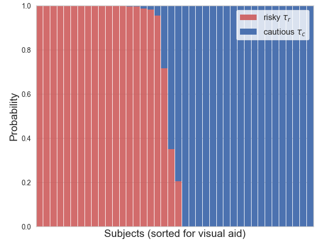
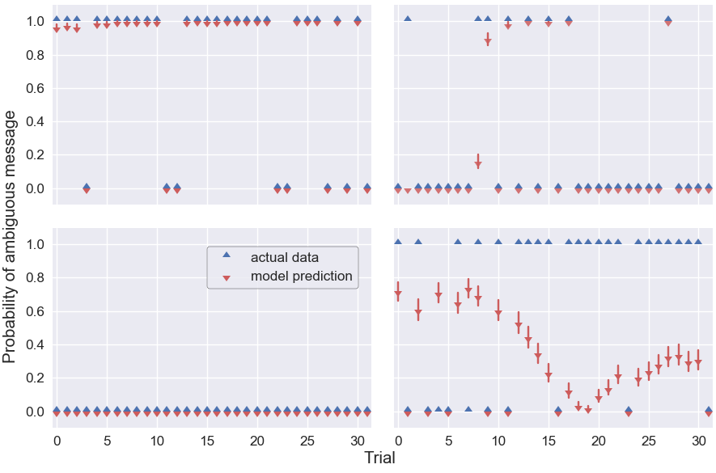
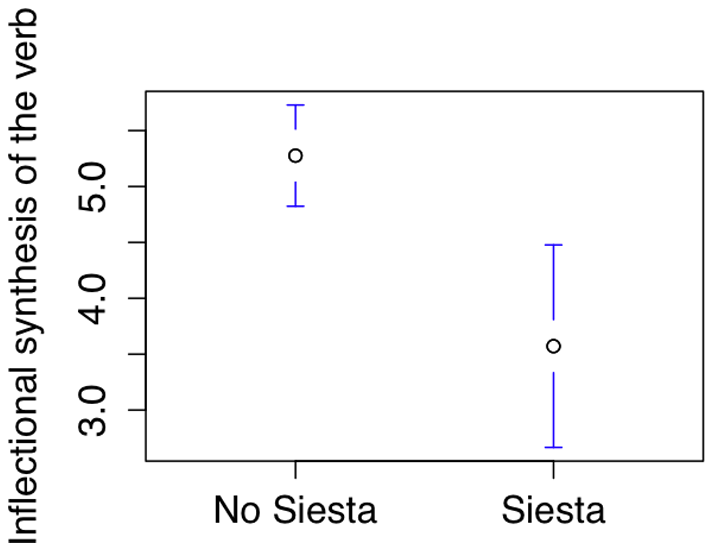

```{r preamble, echo=FALSE, message=FALSE, warning=FALSE}
library(dplyr)
library(ggplot2)
```

# Hoy

.large[
* Recapitulación

* Más allá: Métodos empiricos inferenciales

* Más allá: Ciencias del lenguaje empiricas


]

---


class: inverse, center

# Recapitulación

---

# Ciclo de análisis


---


# Análisis inferencial vs. descriptivo

--

.large[
* Inferencia de propiedades (más allá de la muestra) 

* Predicción

* Comparación

* Causa-efecto 
]


---


.footnote[
*** 
Fig. 1 de Franconeri et al. 2021 [The Science of Visual Data Communication: What Works](https://journals.sagepub.com/stoken/default+domain/10.1177%2F15291006211051956-FREE/full#_i28)]

---

### Replicabilidad

Que se puedan obtener resultados consistentes con los mismo datos de entrada; pasos computacionales; métodos; código; y condiciones de análisis

***
--


### Reproducibilidad

Que se puedan obtener resultados consistentes en diferentes análisis que buscan responder la misma pregunta, cada cual con sus propios datos

---

# Diseño de análisis (componentes)

* Pregunta(s) del análisis

* Plan de diseño

* Plan de muestreo (sampling plan)

* Especificación de variables

* Plan de análisis

---

## Terminología: Tipos de variables

* **Nominales** 

* **Ordinales** 

* **Binarias** 

* **Booleanas** 

* **Métricas**

---

## Terminología: Tipos de muestras
**Muestra completa**: 
toda la población  de interés 
<br>
<br>
--
**Muestra representativa/sin sesgo**: tomada de la muestra completa con un método que no depende de la muestra que se está tomando
<br>
<br>
--
**Muestra no representativa/con sesgo**: los datos son influenciados por el método de toma

---

## Terminología: Distribuciones

* Gaussiana/Normal

* Poisson

* Bernoulli (Binomial)


---


# Ciclo de análisis


---

# Control y crítica

* Estudios piloto

* Simulaciones

---


# Ciclo de análisis


---

# Exploración

* (Manipulación)

* Estadística descriptiva

* Visualización

---

# Análisis

* Regresión lineal generalizada con uno o más predictores

  * Normal/Gaussiana
  
  * Poisson
  
  * Bernoulli

* Visualización

* Análisis de corpus

---

# Fenómenos

* Tono

* Gestos

* Ambigüedad temporal

* Resolución de pronómbres

* Leyes de Zipf (laboratorio y gran escala)

* ...

---

class: inverse, center

# Kahoot!

## [www.kahoot.it](http://www.kahoot.it)


---

class: inverse

# Más allá: Métodos empiricos inferenciales

---

## Paramétricos

* Modelos lineales (hierárquicos)

* k-means

* ...

*** 

## No-paramétricos

* Modelos generalizados aditivos

* Redes neuronales (en realidad no, pero en términos prácticos sí)

* ...

---

# Modelo hierarquico para Kanwal et al. 2017

Hay dos tipos "latentes" de hablantes:

  1. Arriesgados: Piensan que el interlocutor piensa que el significado frequente es más esperado
  2. Cuidadosos: Tienen incertidumbre sobre cual es el significado esperado
  
Hablantes usan el mensaje (que consideran) más probable a ser entendido, minimizando longitud de mensaje


---




---





---
# K-means

--


---

# Generalized Additive Models

```{r, echo=FALSE, warning=FALSE, message=FALSE, fig.align= 'center'}

n  <- 1e3
dat <- data.frame("x1" = rnorm(n), "x2" = rnorm(n), "x3" = rnorm(n))
dat$y <- with(dat, sin(x1) + 0.5*x2^2 + pmax(x2, 0.2) * rnorm(n))

ggplot(dat, aes(x = x1, y = y)) +
  geom_point() +
  geom_smooth() + 
  theme_minimal(base_size = 22)

```

---


---

Todos estos métodos siguen el mismo proceso:

* Define objectivo ("función de perdida")

* "Aprende" de los datos

* Encuentra el parámetro, o combinación de parámetoros, que minimizan la perdida (maximizan el objectivo)

---

Todos estos métodos siguen el mismo proceso:

* Define objectivo ("función de perdida")

* "Aprende" de los **[datos]()**

  * Calidad de datos
  
  * Razón por qué una o más variables podrían solucionar el problema

* Encuentra el parámetro, o combinación de parámetoros, que minimizan la perdida (maximizan el objectivo)

.footnote[
*** 

* [Human in the Loop: Active learning and annotation for human-centered AI](https://www.manning.com/books/human-in-the-loop-machine-learning)

* [Linguistic Diversity and Traffic Accidents: Lessons from Statistical Studies of Cultural Traits](https://journals.plos.org/plosone/article?id=10.1371/journal.pone.0070902)

]


---


.footnote[
*** 

[Linguistic Diversity and Traffic Accidents: Lessons from Statistical Studies of Cultural Traits](https://journals.plos.org/plosone/article?id=10.1371/journal.pone.0070902)

y = Linguistic diversity index: probabilidad que dos personas de una población tengan la misma lengua nativa

]
---





.footnote[
*** 

y = Promedio de categorias gramáticales que puede tomar el verbo
]
---

class: inverse

# Más allá: Ciencias del lenguaje empiricas

---

De momento: Saliendo lentamente de la crísis de replicabilidad

"Nuevas" áreas de investigación/aplicación:

  * Traducción asistida
  
  * Tipología computacional
  
  * Human in the loop QA
  
  * PLN
  
  * Metodologías de aprendizaje asistidas / automatizadas
  
  * ...
  
---

class: inverse

# Y ahora a dónde?


---

class: inverse

# Preguntas?

---

class: inverse

# Coda

* Avaldo (20/06)

* Informe final: 28/06


---

class: inverse, center

# Gracias!

### [https://brochhagen.github.io/](https://brochhagen.github.io/)
### [thomas.brochhagen@upf.edu](thomas.brochhagen@upf.edu)
### [52.631](52.631)
