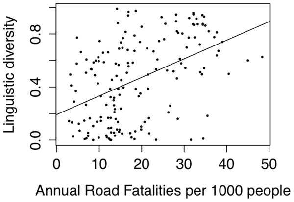

```{r preamble, echo=FALSE, message=FALSE, warning=FALSE}
library(dplyr)
library(ggplot2)
```

# Avui

.large[
* Recapitulació

* Més enllà: Mètodes empírics inferencials

* Més enllà: Ciències del llenguatge empíriques


]

---

class: inverse, center

# Recapitulació

---

# Cicle d'anàlisi


---


# Anàlisi inferencial vs. descriptiu

--

.large[
* Inferència de propietats (més enllà de la mostra)

* Predicció

* Comparació

* Causa-efecte

]


---


.footnote[
*** 
Fig. 1 de Franconeri et al. 2021 [The Science of Visual Data Communication: What Works](https://journals.sagepub.com/stoken/default+domain/10.1177%2F15291006211051956-FREE/full#_i28)]

---

### Replicabilitat

Que es puguin obtenir resultats consistents amb les mateixes dades d'entrada; passos computacionals; mètodes; codi; i condicions d'anàlisi

***
--


### Reproduïbilitat

Que es puguin obtenir resultats consistents en diferents anàlisis que busquen respondre la mateixa pregunta, cadascú amb les seves pròpies dades

---

# Disseny d'anàlisi (components)

* Pregunta(es) de l'anàlisi

* Pla de disseny

* Pla de mostreig (sampling pla)

* Especificació de variables

* Pla d'anàlisi

---

## Terminologia: Tipus de variables

* **Nominals**

* **Ordinals**

* **Binàries**

* **Booleanes**

* **Mètriques**

---

## Terminologia: Tipus de mostres

**Mostra completa**:
tota la població d'interès
<br>
<br>
--
**Mostra representativa/sense biaix**: recollida de la mostra completa amb un mètode que no depèn de la mostra que s'està prenent
<br>
<br>
--
**Mostra no representativa/amb biaix**: les dades són influenciades pel mètode de recollida

---

## Terminologia: Distribucions

* Gaussiana/Normal

* Poisson

* Bernoulli (Binomial)


---


# Cicle d'anàlisi


---

# Control i crítica

* Estudis pilot

* Simulacions

---


# Cicle d'anàlisi


---

# Exploració

* (Manipulació)

* Estadística descriptiva

* Visualització

---

# Anàlisi

* Regressió lineal generalitzada amb un o més predictors

   * Normal/Gaussiana
  
   * Poisson
  
   * Bernoulli

* Visualització

* Anàlisi de corpus

---

# Fenòmens

* To

* Gestos

* Ambigüitat temporal

* Lleis de Zipf (laboratori i gran escala)

* ...

---

class: inverse, center

# Kahoot!

## [www.kahoot.it](http://www.kahoot.it)


---

class: inverse

# Més enllà: Mètodes empirics inferencials

---

## Paramètrics

* Models lineals (heràrquics)

* k-means

* ...

***

## No-paramètrics

* Models generalitzats additius

* Xarxes neuronals (en realitat no, però en termes pràctics sí)

* ...


---
# K-means

--


---

# Generalized Additive Models

```{r, echo=FALSE, warning=FALSE, message=FALSE, fig.align= 'center'}

n  <- 1e3
dat <- data.frame("x1" = rnorm(n), "x2" = rnorm(n), "x3" = rnorm(n))
dat$y <- with(dat, sin(x1) + 0.5*x2^2 + pmax(x2, 0.2) * rnorm(n))

ggplot(dat, aes(x = x1, y = y)) +
  geom_point() +
  geom_smooth() + 
  theme_minimal(base_size = 22)

```

---


---

Tots aquests mètodes segueixen el mateix procés:

* Defineix objectiu ("funció de pèrdua")

* "Aprèn" de les dades

* Troba el paràmetre, o combinació de paràmetres, que minimitzen la pèrdua (maximitzen l'objectiu)

---

Tots aquests mètodes segueixen el mateix procés:

* Defineix objectiu ("funció de pèrdua")

* "Aprèn" dels **[dades]()**

   * Qualitat de dades
  
   * Qualitat de (les suposicions) del model

* Troba el paràmetre, o combinació de paràmetres, que minimitzen la pèrdua (maximitzen l'objectiu)

.footnote[
*** 

* [Human in the Loop: Active learning and annotation for human-centered AI](https://www.manning.com/books/human-in-the-loop-machine-learning)

* [Linguistic Diversity and Traffic Accidents: Lessons from Statistical Studies of Cultural Traits](https://journals.plos.org/plosone/article?id=10.1371/journal.pone.0070902)

]


---





.footnote[
*** 

[Linguistic Diversity and Traffic Accidents: Lessons from Statistical Studies of Cultural Traits](https://journals.plos.org/plosone/article?id=10.1371/journal.pone.0070902)

y = Linguistic diversity index: probabilitat que dues persones d'una població tinguin la mateixa llengua nativa

]
---


.footnote[
*** 

y = Mitjana de categories gramàtiques que pot prendre el verb
]
---

class: inverse

# Més enllà: Ciències del llenguatge empíriques

---

De moment: Sortint lentament de la crisi de replicabilitat

"Noves" àrees de recerca/aplicació:

   * Traducció assistida
  
   * Tipologia computacional
  
   * Human in the loop QA
  
   * PLN
  
   * Metodologies d'aprenentatge assistides/automatitzades
  
   * ...
  
---

class: inverse

# I ara on?

---

class: inverse

# Preguntes?

---

class: inverse

# Coda

* Avaldo 

* Informe final: 25/06


---

class: inverse, center

# Gràcies!

### [https://brochhagen.github.io/](https://brochhagen.github.io/)
### [thomas.brochhagen@upf.edu](thomas.brochhagen@upf.edu)
### [52.609](52.609)
