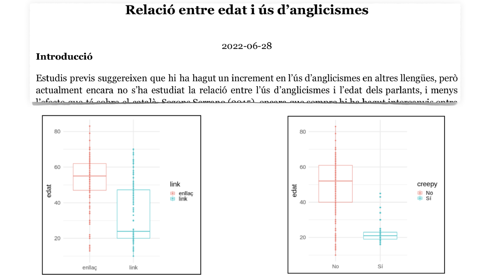

```{r preamble, echo=FALSE, message=FALSE, warning=FALSE}
library(dplyr)
library(ggplot2)
```

# Avui

.large[
* Organització del curs

* Sinopsi del curs

* Replicabilitat i reproduïbilitat

* R

* Estadística descriptiva

]

---

class: inverse, center

# Organització

---

# Informació bàsica

.large[
* 5 ECTS (~125-150 hores)

* Material i comunicació: https://aulaglobal.upf.edu/

* Equip
   * Thomas Brochhagen (thomas.brochhagen@upf.edu)<br> https://brochhagen.github.io
  
   * Iria de Dios Flores (iria.dedios@upf.edu)<br> https://sites.google.com/view/iriadediosflores/

* Estructura
   * Dilluns: Conceptes i discussió
  
   * Divendres: Pràctica i més discussió

]

---

# Horari grup gran

> Per facilitar que els estudiants tinguin temps de canviar d'aula, caldrà deixar sempre 10 minuts de cortesia a l'inici de la sessió [...]

<br><br>
### $\Rightarrow$ 11:40 - 13:25


---

# Avaluació
.large[
* Exercicis setmanals (20%, no recuperable)

* Exercici pràctic (20%, no recuperable)

* Revisió per parells (10%, no recuperable)

* Informe: disseny i execució d'anàlisi (50%, recuperable)
]
---

# Avaluació

.large[
Exercicis setmanals (20%, no recuperable)
  
  * A través d'Aula Global
  
  * Correcció automàtica
  
  * 5 en total
]

---

# Avaluació

.large[
Exercici pràctic (20%, no recuperable)

  * *take home exam/study* (1 setmana per fer-ho)

  * A través d'Aula Global
  
  * A meitat de curs

]

---

# Avaluació 
.large[
Revisió per parells (10%, no recuperable)

  * Dues parts:
    1. Esborrany del vostre pla per l'anàlisi final
    
    2. Feedback sobre el esborrany de dos companyes

  * Només opció d'aprovar, o no

  * No s'aprova si no es lliuren les dues parts; o si qualsevol no s'adequa a un estàndard mínim de qualitat
]


---

# Avaluació

.large[
Disseny i execució d'anàlisi (50%)
* Individual o en grup

* Al final del curs

* "Recuperable" com a examen

* Criteris d'avaluació i exemples: Aula Global

]


---




---

# Altres exemples

* "Carrota vs. pastanaga en el territori alt empordanès"

* "S'ha substituït més de pressa el dialecte balear pel central que el nord-occidental en venir a Barcelona?"

* "Intercomprensión románica o plurilingüísmo: análisis de identificación de lenguas"

* "Evaluating linguistic laws on the Harry Potter saga"

* ...


---

# Avaluació
.large[
* Exercicis setmanals (20%, no recuperable)

* Exercici pràctic (20%, no recuperable)

* Revisió per parells (10%, no recuperable)

* Informe: disseny i execució d'anàlisi (50%, recuperable)
]

---

class: inverse, center

# Sinopsi del curs

---
<br><br><br><br>
<div class="warning" style='padding:0.1em; background-color:#E9D8FD; color:#69337A'>
<span>
<p style='margin-top:1em; text-align:center'>
<b>Què és un mètode empíric?</b>
<br><br>
Doneu un exemple
</p>
</p></span>
</div>


---

# Cicle d'anàlisi


---

# A efectes pràctics
.large[
* Manipulació i interpretació de dades

* Comparació de grups

* Predicció

* Visualització

<br><br>

.center[... aplicat a ciències del llenguatge]
]

---

class: center, inverse

# Anàlisi inferencial


---

<br><br><br><br>
<div class="warning" style='padding:0.1em; background-color:#E9D8FD; color:#69337A'>
<span>
<p style='margin-top:1em; text-align:center'>
<b>Què és un anàlisi descriptiu?</b>
<br><br>
Doneu un exemple
</p>
</p></span>
</div>


---


# Anàlisi inferencial (vs. descriptiu)
.large[
* Inferència de propietats més enllà de la mostra

* Predicció

* Comparació

* Causa-efecte

]
---


.footnote[
*** 
Fig. 1 de Franconeri et al. 2021 [The Science of Visual Data Communication: What Works](https://journals.sagepub.com/stoken/default+domain/10.1177%2F15291006211051956-FREE/full#_i28)]
---

# Exemples
Estimació de l'efecte d'un o més *predictores* en un *resultat*

--

* Fluïdesa en L2 dependent de L1
  
* Probabilitat de l'ús d'un (pro)nom a la base del seu entorn lingüístic
  
* Comparació d'un mètode d'aprenentatge de la llengua contra un altre
  
* Comparació de polítiques lingüístiques i les seves conseqüències

* ...


---
class: inverse, center

# Replicabilitat i reproduïbilitat

---

### Replicabilitat

Que es puguin obtenir resultats consistents amb les mateixes dades d'entrada; passos computacionals; mètodes; codi; i condicions d'anàlisi

***
--


### Reproduïbilitat

Que es puguin obtenir resultats consistents en diferents anàlisis que busquen respondre la mateixa pregunta, cadascú amb les seves pròpies dades

---

.left[Replication is one of the central issues in any empirical science. 

To confirm results or hypotheses by a repetition procedure is at the basis of any scientific conception. A replication experiment to demonstrate that the same findings can be obtained in any other place by any other researcher is conceived as an operationalization of objectivity. 

It is the proof that the experiment reflects knowledge that can be separated from the specific circumstances (such as time, place, or persons) under which it was gained.
<br><br>
-Stefan Schmidt 
]

---

# Crisi de replicabilitat i reproduïbilitat

* Una quantitat important de resultats no s'han pogut ni replicar ni reproduir (50%-80%, depenent del camp)

--

* Va comportar un gran canvi en metodologia i documentació (estem en això)

--

* Independentment, és central documentar totes les teves decisions i manipulacions; de principi a fi

--

* Llengües de programació són una eina ideal per
   * conduir anàlisi empírica, i
  
   * assegurar-se que sigui replicable

---

class: inverse, center

# R 

---


```{r, echo=TRUE, warning=FALSE, eval=TRUE, message=FALSE,fig.align='center',out.width='100%'}
x <- c(5, 3, 8, 4) # vector of values

mean(x)            # mean of x   
```

---
# En aquest curs

* Ús rudimentari i interactiu

* Principalment: intuïció sobre estructures de dades i la seva manipulació

* Manera d'assegurar replicabilitat


---

class: inverse, center

# Estadística descriptiva

---

# Estadística descriptiva


.large[
* Tendències centrals (mitja; mitjana; moda)

* Mesures de dispersió (variança; desviació típica)

* Mesures de variació conjunta (correlació, covariança)
]

.footnote[

***

Si cal fer una revisió: Franke (2021) [*An Introduction to Data Analysis*, capítol 5](https://michael-franke.github.io/intro-data-analysis/Chap-02-03-summary-statistics. html)
]

---
.large[
Propera sessió de seminari:

  * Petit resum d'estadística descriptiva
  
  * R (i Collaborate)

]

.footnote[

***

Si cal fer una revisió: Franke (2021) [*An Introduction to Data Analysis*, capítol 5](https://michael-franke.github.io/intro-data-analysis/Chap-02-03-summary-statistics. html)
]


---


class: inverse
# Propera sessió

* Si n'hi ha, preguntes generals sobre el curs

* Si n'hi ha, preguntes generals sobre l'informe final<br><br>(llegiu "Report guidelines" i els dos informes exemplars abans)

***

* **Disseny d'anàlisi**

