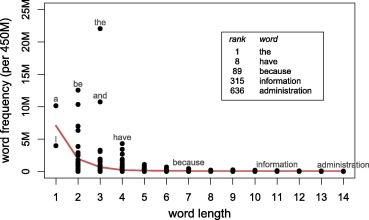

```{r preamble, echo=FALSE, message=FALSE, warning=FALSE}
library(dplyr)
library(ggplot2)
```

# Avui

.large[
* Components d'una anàlisi

* Vocabulari de disseny experimental

* Repàs estadística descriptiva

]

---

class: inverse, center

# Components d'una anàlisi


---

<br><br><br><br>
<div class="warning" style='padding:0.1em; background-color:#E9D8FD; color:#69337A'>
<span>
<p style='margin-top:1em; text-align:center'>
<b>Quins components té una anàlisi?</b>
</p>
</p></span>
</div>

---

# Components

* Pregunta(/es) de l'anàlisi

* Pla de disseny

* Pla de mostreig (sampling plan)

* Especificació de variables

* Pla d'anàlisi

---

# Components

* **Pregunta(/es) de l'anàlisi**
   * Poden variar en grau de granularitat
  
   * Poden variar en naturalesa: Anàlisi confirmatòria vs. exploratoria

* Pla de disseny

* Pla de mostreig (sampling pla)

* Especificació de variables

* Pla d'anàlisi

---

# Components

* Pregunta(es) de l'anàlisi

* **Pla de disseny**
   * Descripció general de l'anàlisi.
  
   * Entre altres, especifica què mesuraràs, i en quines circumstàncies

* Pla de mostreig (sampling pla)

* Especificació de variables

* Pla d'anàlisi

---

# Components

* Pregunta(es) de l'anàlisi

* Pla de disseny

* **Pla de mostreig (sampling pla)**
   * Quantes observacions recol·lectaràs? Com? Per què?

* Especificació de variables

* Pla d'anàlisi
---


# Components

* Pregunta(es) de l'anàlisi

* Pla de disseny

* Pla de mostreig (sampling pla)

* **Especificació de variables**
   * Descripció de totes les variables que juguen un rol a la teva anàlisi

* Pla d'anàlisi
---

# Components

* Pregunta(es) de l'anàlisi

* Pla de disseny

* Pla de mostreig (sampling pla)

* Especificació de variables

* **Pla d'anàlisi**
   * Descripció de com analitzaràs les dades
  
---

## Zipf's Law of Abbreviation
---

### Zipf's Law of Abbreviation: Formes més freqüents tendeixen a ser més curtes
<br><br>
.center[### 
]


 
.footnote[
***

G.K. Zipf (1935) *The psycho-biology of language*<br>
Kanwal et al. (2017) *Zipf’s Law of abbreviation as a language universal*

]

---

<br><br><br><br>
<div class="warning" style='padding:0.1em; background-color:#E9D8FD; color:#69337A'>
<span>
<p style='margin-top:1em; text-align:center'>
<b>Originalment, la llei es va descriure abans d'ordinadors o grans corpus; i només per a l'anglès. Penseu que es compleix en tots els idiomes?</b>
</p>
</p></span>
</div>

---

### Zipf's Law of Abbreviation: Formes més freqüents tendeixen a ser més curtes
<br><br>
.center[### 
]


 
.footnote[
***

G.K. Zipf (1935) *The psycho-biology of language*<br>
Benz & Ferrer-i-Cancho (2016) * Zipf’s Law of abbreviation as a language universal*


]
---

<br><br><br><br>
<div class="warning" style='padding:0.1em; background-color:#E9D8FD; color:#69337A'>
<span>
<p style='margin-top:1em; text-align:center'>
<b>Per què hi ha aquesta relació entre brevetat i freqüència?</b>
</p>
</p></span>
</div>


---

# Kanwal et al. 2017

--


---

# Kanwal et al. 2017: Condicions

1. Comunicació amb un altre jugador, amb diferencial de temps entre missatges

--

2. Comunicació amb un altre jugador, sense diferencial de temps

--

3. Sense un altre jugador, amb diferencial de temps entre missatges

--

4. Sense un altre jugador, sense diferencial de temps

---

# Kanwal et al. 2017: Resultat

Només amb diferencial de temps entre missatges:

  missatge més curt $\Rightarrow$ significat més freqüent

---

# Components (Kanwal et al. 2017)

* Preguntes de l'anàlisi

* Pla de disseny

* Pla de mostreig (sampling plan)

* Especificació de variables

* Pla d'anàlisi

---

# Components (Kanwal et al. 2017)

* **Preguntes de l'anàlisi**
   1. Emergeix la llei d'abreujament d'una interacció entre dues pressions lingüístiques: brevetat i comunicació?
  
   2. Emergeix (1) en un diàleg artificial de laboratori en un parell de rondes?
  
* Pla de disseny

* Pla de mostreig (sampling plan)

* Especificació de variables

* Pla d'anàlisi

---

# Components (Kanwal et al. 2017)

* Preguntes de l'anàlisi

* **Pla de disseny**

   * Analitzarem si un ús d'expressions referencials que reflecteix la llei d'abreujament de Zipf (més freqüent $\rightarrow$ més curta) emergeix en funció d'una interacció i presència de dues pressions lingüístiques: pressió per comunicació i per brevetat.
  
   * Controlarem la presència/absència de les pressions en un experiment de laboratori, usant una llengua artificial per també controlar l'inventari lèxic a disposició de cada parlant
  
   * Hi haurà 4 condicions: $[\pm comunicació] \; \times \; [\pm brevetat]$
  
   * Esperem que ús d'expressions referencials en línia amb la llei d'abreujament de Zipf només emergeixi si les dues pressions són presents: $[+ comunicació] \; \times \; [+ brevetat]$

* Pla de mostreig (sampling plan)

* Especificació de variables

* Pla d'anàlisi

---

# Components (Kanwal et al. 2017)

* Preguntes de l'anàlisi

* Pla de disseny

* **Pla de mostreig (sampling plan)**

   * 124 participants: 31 per condició
  
   * Reclutats a través de MTurk
  
   * Criteris d'exclusió
  
   * ...

* Especificació de variables

* Pla d'anàlisi

---


# Components (Kanwal et al. 2017)

* Preguntes de l'anàlisi

* Pla de disseny

* Pla de mostreig (sampling pla)

* **Especificació de variables**

   * Ús d'expressió curta
  
   * Referent a comunicar
  
   * ID de subjecte i parell
  
   * Torn

* Pla d'anàlisi

---


# Components (Kanwal et al. 2017)

* Pregunta(es) de l'anàlisi

* Pla de disseny

* Pla de mostreig (sampling pla)

* Especificació de variables

* **Pla d'anàlisi**

   * Regressió logística amb expressió com a variable dependent, i freqüència del referent com a variable independent

---

class: inverse, center

# Dades i terminologia

---

# Tipus d'estudis

* Observacionals

* Experimentals

* Virtuals (simulació, predicció)


---

# Tipus de variables

* **Nominals** 

* **Ordinals** 

* **Binàries**

* **Booleanes** 

* **Mètriques**

---

# Tipus de variables

* **Nominals** (gènere; idioma matern; lloc d'origen)

* **Ordinals** (anys cursats; edat)

* **Binàries**

* **Booleanes** (veritat/fals)

* **Mètriques** (nombre d'usos de pronoms; to)

---

# Preregistration

Quan registreu prèviament la vostra recerca, simplement especifiqueu el vostre pla de recerca abans del vostre estudi i l'envieu a un registre.

* Més informació: https://www.cos.io/initiatives/prereg

* Exemple 1:<br>Replication of “Psycholinguistic Evidence for presuppositions: On-line and Off-line Data. Experiment 3: Accommodation”<br>https://osf.io/xugwf/

* Exemple 2:<br>Influence of Centrality on Communication Protocols in Communities of Deep Neural Agents<br>https://osf.io/xn6gc

### 


---

# Més informació sobre disseny 

* Experimentology. An Open Science Approach to Experimental Psychology Methods<br>https://experimentology.io/

* An Introduction to Data Analysis<br>https://michael-franke.github.io/intro-data-analysis/index.html


---

class: inverse

# Propera sessió

* Lliurament de "Assignment 1" (08:00 AM 22/04)

***

* **Recol·lecció de dades i mostres**

