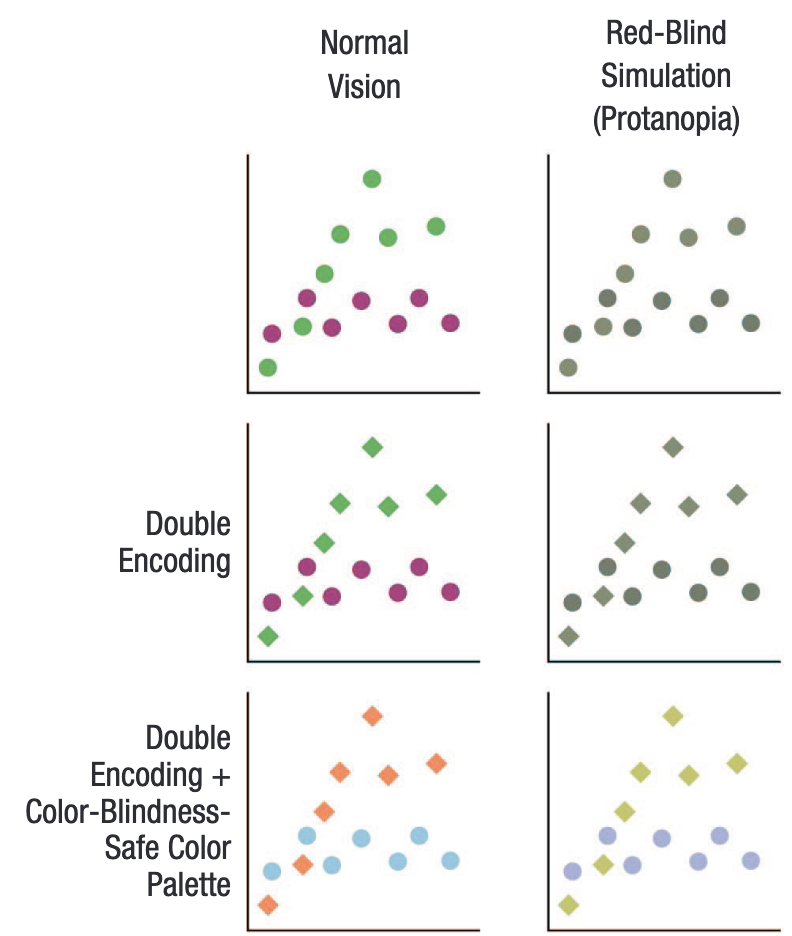

```{r preamble, echo=FALSE, message=FALSE, warning=FALSE}
library(dplyr)
library(ggplot2)
```

# Avui

.large[
* Alguns tipus de visualització

* Principis de visualització

* ggplot2

]
---


class: inverse, center

# Alguns tipus de visualització

---

## Scatter plots (dades contínues; una sola relació)

```{r, warning=FALSE, message=FALSE, echo=FALSE, fig.align='center'}
set.seed(113)

age <- rpois(n = 30, lambda = 28)
pitch <- 220 + (-2 * age) + rnorm(30, 0,5)

df <- data.frame(age,pitch)
ggplot(df, aes(x = age, y = pitch)) + 
  geom_point() +
  theme_minimal(base_size = 22)
```

---

## Histogramas (distribució d'una sola variable)


```{r, warning=FALSE, message=FALSE, echo=FALSE, fig.align='center'}

ggplot(df, aes(x = pitch)) +
  geom_histogram(bins = 10) +
  theme_minimal(base_size = 22)

```

---

## Boxplots  (distribució d'una sola variable [grups])

```{r, warning=FALSE, message=FALSE, echo=FALSE, fig.align='center'}
df_gestures <- read.csv('https://tinyurl.com/gestures-data') #download data

ggplot(df_gestures, aes(x = language, y = gestures)) +
  geom_boxplot() +
  theme_minimal(base_size = 22) +
  theme(axis.title.x = element_blank())
```

---

# Boxplots

* mínim 

* màxim

* mediana

* Q1

* Q3

* IQR (Q3 - Q1)

***

.footnote[
https://ggplot2.tidyverse.org/reference/geom_boxplot.html#summary-statistics
]

---

## Boxplots  (distribució d'una sola variable [grups])

```{r, warning=FALSE, message=FALSE, echo=FALSE, fig.align='center'}
df_gestures <- read.csv('https://tinyurl.com/gestures-data') #download data

ggplot(df_gestures, aes(x = language, y = gestures, fill = context)) +
  geom_boxplot() +
  theme_minimal(base_size = 22) +
  theme(axis.title.x = element_blank())
```

---

# El cel és el límit

[https://r-statistics.co/Top50-Ggplot2-Visualizations-MasterList-R-Code.html](https://r-statistics.co/Top50-Ggplot2-Visualizations-MasterList-R-Code.html)


---


class: inverse, center

# Principis de visualització


---


.footnote[
*** 
Fig. 1 de Franconeri et al. 2021 [The Science of Visual Data Communication: What Works](https://journals.sagepub.com/stoken/default+domain/10.1177%2F15291006211051956-FREE/full#_i28)]

---

# Tres heurístiques

1. Objectiu: La visualització té un objectiu ben definit

--

2. Claredat: Les dades són visualitzades de manera clara (i simple)

--

3. Missatge: Fes que el missatge sigui immediat/evident

---

.pull-left[# Canales visuales 
### rànquing per nitidesa cognitiva

###  1:7
]


---


# Accessibilitat i doble codificació



.footnote[
*** 
Fig. 2 de Franconeri et al. 2021 [The Science of Visual Data Communication: What Works](https://journals.sagepub.com/stoken/default+domain/10.1177%2F15291006211051956-FREE/full#_i28)]

---

# Recomanacions

* Utilitza visualització per guiar la computació d'estadístiques

--

* Limita el nombre de comparacions per gràfic

--

* En cas de dubte: Minimalisme

--

* Respecta direccionalitat "natural", si n'hi ha

--

* Cura amb il·lusions visuals

---

## Guia computació d'estadístiques

```{r, warning=FALSE, message=FALSE, echo=FALSE, fig.align='center'}


ggplot(df, aes(x = age, y = pitch)) + 
  geom_point() +
  geom_smooth(method= 'lm') + 
  theme_minimal(base_size = 22)
```

---

## Guia computació d'estadístiques

```{r, warning=FALSE, message=FALSE, echo=FALSE, fig.align= 'center'}
df_gestures <- read.csv('https://tinyurl.com/gestures-data') #download data

ggplot(df_gestures, aes(x = language, y = gestures)) +
  geom_boxplot() +
  theme_minimal(base_size = 22) +
  theme(axis.title.x = element_blank())

```
---

## Nombre de comparacions per gràfic (I/II)

```{r, warning=FALSE, message=FALSE, echo=FALSE, fig.align= 'center'}
df_gestures <- read.csv('https://tinyurl.com/gestures-data') #download data

ggplot(df_gestures, aes(x = language, y = gestures)) +
  geom_boxplot() +
  theme_minimal(base_size = 22) +
  theme(axis.title.x = element_blank())
```

---

## Nombre de comparacions per gràfic (II/II)

```{r, warning=FALSE, message=FALSE, echo=FALSE, fig.align= 'center'}
df_gestures <- read.csv('https://tinyurl.com/gestures-data') #download data

ggplot(df_gestures, aes(x = language, y = gestures, fill = context)) +
  geom_boxplot() +
  theme_minimal(base_size = 22) +
  theme(axis.title.x = element_blank())
```


---

## Mínimalisme vs Maximalisme (I/III)

```{r, warning=FALSE, message=FALSE, echo=FALSE, fig.align= 'center'}
ggplot(df_gestures, aes(x = language, y = gestures)) +
  geom_boxplot() +
  theme_minimal(base_size = 22) +
  theme(axis.title.x = element_blank())
```

---

## Mínimalisme vs Maximalisme (II/III)


```{r, warning=FALSE, message=FALSE, echo=FALSE, fig.align= 'center'}
ggplot(df_gestures, aes(x = language, y = gestures, fill = context)) +
  geom_boxplot() +
  theme_minimal(base_size = 22) +
  theme(axis.title.x = element_blank())
```

---

## Mínimalisme vs Maximalisme (III/III)


```{r, warning=FALSE, message=FALSE, echo=FALSE, fig.align= 'center'}

m <- lm(gestures ~ language, df_gestures)

ggplot(df_gestures, aes(x = language, y = gestures, fill = context)) +
  geom_boxplot() +
  theme_minimal(base_size = 22) +
  geom_abline(intercept = coef(m)[[1]], slope = coef(m)[[2]], linetype = 2, size=1.5) +
    stat_summary(fun.y=mean, geom="point", shape=20, size=14, color="blue", fill="blue") +
  theme(axis.title.x = element_blank()) 

```

---

# Direccionalitat "natural" (I/II)

```{r, warning=FALSE, message=FALSE, echo=FALSE, fig.align= 'center'}

ggplot(df, aes(x = age, y = pitch)) + 
  geom_point() +
  geom_smooth(method= 'lm') + 
  theme_minimal(base_size = 22) + scale_y_reverse()
```

---

# Direccionalitat "natural" (II/II)

```{r, warning=FALSE, message=FALSE, echo=FALSE, fig.align= 'center'}

ggplot(df, aes(x = age, y = pitch)) + 
  geom_point() +
  geom_smooth(method= 'lm') + 
  theme_minimal(base_size = 22) + scale_x_reverse()

df$gender <- 'F'
pitch <- df$pitch + 0.8
gender <- rep('M', nrow(df))
age <- df$age
df <- df %>% rbind(data.frame(pitch,age,gender))
```

# Il·lusions visuals

```{r, warning=FALSE, message=FALSE, echo=FALSE, fig.align = 'center'}


library(scales)
ggplot(df, aes(y = pitch, x = gender)) + geom_bar(position = 'dodge', stat= 'identity') +  scale_y_continuous(limits=c(183,184.5),oob = rescale_none) +
  theme_minimal(base_size = 22) + theme(axis.title.x = element_blank())

```

---

class: inverse

# ggplot2

---

class: inverse

# Propera sessió

Res / informe final


***

* **Generalized linear models (II)**


